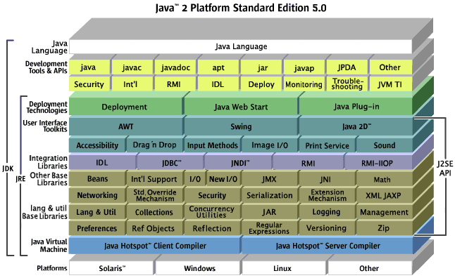
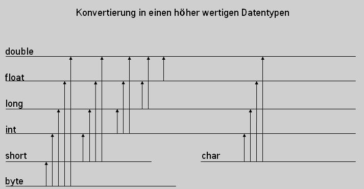
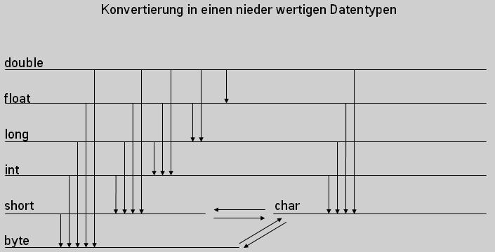

# Softwaretechnologie Java: Inhalte

> **Was ist dieses Dokument bzw. was ist es nicht?**  
> Dies ist eine Übersicht über die Inhalte, die im Seminar besprochen werden sollten. Der Sinn dieses Dokumentes ist es *nicht*, Erläuterungen zu allen Inhalten des Seminars bereitzustellen. Dies ist keine Lern-Ressource oder gar "Script" zum Seminar. Ziel ist vielmehr eine möglichst vollständige und semantisch bzw. didaktisch strukturierte Aufstellung aller Themen und Aspekte, ergänzt durch unterstützende Materialien (siehe Ordner `Materialien`), Links zu relevanten, weiterführenden Ressourcen (mit `#` gekennzeichnet), sowie passende Übungs- und Hausaufgaben aus diesem Repository (siehe Ordner `Hausaufgaben`).

- [Softwaretechnologie Java: Inhalte](#softwaretechnologie-java-inhalte)
- [Die Programmiersprache Java](#die-programmiersprache-java)
- [Erste Schritte](#erste-schritte)
  - [Hello World! :rocket:](#hello-world-rocket)
  - [Pakete](#pakete)
  - [Java-Klassenbibliothek](#java-klassenbibliothek)
- [Eclipse IDE](#eclipse-ide)
- [Variablen](#variablen)
- [Datentypen](#datentypen)
  - [Primitive Datentypen](#primitive-datentypen)
  - [Komplexe Datentypen](#komplexe-datentypen)
  - [Casting / Typumwandlung bei primitiven Datentypen](#casting--typumwandlung-bei-primitiven-datentypen)
- [Methoden](#methoden)
- [Operatoren](#operatoren)
  - [Arithmetische- / Rechenoperatoren](#arithmetische---rechenoperatoren)
- [Post-/Preinkrement](#post-preinkrement)
  - [Vergleichsoperatoren](#vergleichsoperatoren)
  - [Boolsche / Logische Operatoren](#boolsche--logische-operatoren)
  - [Operatoren zur Bit-Manipulation (erstmal weglassen?)](#operatoren-zur-bit-manipulation-erstmal-weglassen)
  - [Zuweisungsoperatoren](#zuweisungsoperatoren)
- [Strings / Zeichenketten](#strings--zeichenketten)
- [Arrays](#arrays)
  - [Deklaration und Initialisierung](#deklaration-und-initialisierung)
  - [Zugriff und Manipulation](#zugriff-und-manipulation)
  - [Mehrdimensionale Arrays](#mehrdimensionale-arrays)
- [Kontrollstrukturen](#kontrollstrukturen)
  - [if, else if, else](#if-else-if-else)
  - [Ternary-Operator](#ternary-operator)
  - [switch](#switch)
  - [Schleifen](#schleifen)
    - [for](#for)
    - [while](#while)
    - [do-while](#do-while)
- [Objektorientierte Programmierung mit Java](#objektorientierte-programmierung-mit-java)
  - [Was ist OOP?](#was-ist-oop)
  - [Klassenvariablen](#klassenvariablen)
  - [Sichtbarkeits- / Zugriffsmodifizierer](#sichtbarkeits---zugriffsmodifizierer)
  - [this](#this)
  - [Getter & Setter](#getter--setter)
  - [Konstruktoren](#konstruktoren)
  - [final](#final)
  - [static](#static)
  - [Konstanten in Java](#konstanten-in-java)
  - [Vererbung](#vererbung)
    - [Terminologie](#terminologie)
    - [Wozu ist das gut?](#wozu-ist-das-gut)
    - [Wie funktioniert das?](#wie-funktioniert-das)
    - [Casting von komplexen Datentypen](#casting-von-komplexen-datentypen)
    - [toString()](#tostring)
    - [equals()](#equals)
    - [Abstrakte Klassen und Methoden](#abstrakte-klassen-und-methoden)
    - [Interfaces](#interfaces)
- [Fehlerbehandlung](#fehlerbehandlung)
- [Dokumentation JavaDoc](#dokumentation-javadoc)


#  Die Programmiersprache Java
- C-artige, universelle Programmiersprache
- JVM [#](https://de.wikibooks.org/wiki/Java_Standard:_Java_Virtual_Machine)
- Bytecode
- Garbage Collector
- von Grund auf objektorientiert [#](https://de.wikibooks.org/wiki/Java_Standard:_Objektorientierung)
- sehr umfangreiche Standard-Library / Klassenbibliothek


Grafik: [#](Materialien/Java-Platform-Diagram.png)

# Erste Schritte

## Hello World! :rocket:
- Woraus besteht eine **Klasse** mindestens?
- Was ist eine **Methode**?
- **main**-Methode mit "Hello World!"
  - Einstiegspunkt ins Programm
  - Was ist ein String / Zeichenkette (Klasse/Objekt!)?

```java
public class HelloWorld {
      public static void main(String[] args) {
          System.out.println("Hello World!"); // ach, was!
      }
}
```

## Pakete
- Was sind Pakete und wozu sind sie da? [#](https://de.wikibooks.org/wiki/Java_Standard:_Erste_Schritte#Pakete)
- Wie sehen Pakete auf meiner Festplatte aus?
  
## Java-Klassenbibliothek
- Beispiele für häufig verwendete Klassen [#](https://de.wikibooks.org/wiki/Java_Standard:_Erste_Schritte#Klassenbibliothek)
- Paketstruktur der Klassenbibliothek

# Eclipse IDE
- Was ist das für ein Programm? [#](https://de.wikibooks.org/wiki/Java_Standard:_Einrichten_der_Programmierumgebung#Eclipse)
- Die wichtigsten Views (Package Manager, Editor, Outline, Console)
- Das erste Projekt anlegen
  - Was ist da alles drin?
  - Wo findet man das Paket-Konzept wieder?
- Import / Export von Projekten
- Programme ausführen über Kontextmenü und "Play"-Button

# Variablen
- sind Bezeichner für Werte in bestimmten Speicherbereichen, die mit der Variable angesprochen werden können
- Java ist streng typisiert, Deklaration daher immer unter Angabe des Datentyps
- naming conventions (lowerCamelCase)
- Gültigkeitsbereiche
  - Methode, Kontrollstruktur oder Klasse (siehe [Klassenvariablen](#klassenvariablen))

# Datentypen

## Primitive Datentypen
- `byte`, `short`, `int`, `long`, `float`, `double`, `boolean`, `char`
- Welche **default values** haben diese Datentypen?


Grafik: [#](Materialien/primitive-data-types.png), Quelle [#](https://de.wikibooks.org/wiki/Java_Standard)

## Komplexe Datentypen
- Klassen und Arrays sind komplexe Datentypen (dazu später mehr!)

## Casting / Typumwandlung bei primitiven Datentypen
- Implizite Typumwandlung: Ein "niederwertiger" Typ wird einem "höherwertigen" Typ zugewiesen (Umwandlung geschieht automatisch)
  - `double d; int i = 2; d = i;`


Grafik: [#](Materialien/typecast_1.jpg), Quelle: [#](https://www.java-tutorial.org/typecasting.html)

- Explizite Typumwandlung: Ein "höherwertiger" Typ wird in "niederwertigen" Typ umgewandelt
  - geschieht mittels cast-Operator
  - Ziel-Typ **muss** angegeben werden
  - `double d = 2.2d; int i; i = (int) d;`


Grafik: [#](Materialien/typecast_2.jpg), Quelle: [#](https://www.java-tutorial.org/typecasting.html)

# Methoden
- Rückgabetyp / `void`
- Parameter
- `return`
- naming: `lowerCamelCase()`
- Überlagerung von Methoden

# Operatoren

## Arithmetische- / Rechenoperatoren
- Einfache: ` + - * / % `
  
# Post-/Preinkrement
- Ausdruck und Operation mittels: `++` / `--`

```java
// Unterschied Post-/Preinkrement:
int i = 5;
int x = ++i; // i = 6 und x = 6 (hochzählen, dann zuweisen)

int i = 5;
int x = i++; // i = 6 und x = 5 (zuweisen, dann hochzählen)
```

## Vergleichsoperatoren
- Ergebnis von Vergleichsoperationen ist **immer** `true` oder `false`!
- `==`, `!=`, `>`, `<`, `>=`, `<=`

## Boolsche / Logische Operatoren
- `&&` und `||`
- Negation: `!` (invertiert einen Ausdruck)
- Exklusives ODER: `!=` (wenn nur 1 Operand `true` ist)

## Operatoren zur Bit-Manipulation (erstmal weglassen?)
- `~`, `&`, `|`, `^`
- `>>`, `>>>`, `<<`

## Zuweisungsoperatoren
- Einfache: `=`
- Arithmetische: `+=`, `-=`, `/=`, `*=`, `%=`
- Logische: `&=`, `|=`, ...

```java
// Logische Zuweisungsoperatoren
boolean t = true;
boolean f = false;
t &= f; // hiernach: t = false, weil nicht beide true
```

# Strings / Zeichenketten
- `String` ist eine Klasse in Java
- Ein `String` ist eine Zeichenkette, also eine Sequenz (intern: Array) von `char`-Werten
- Strings sind in Java **nicht veränderlich** (denn sie sind Arrays von `char`s)
- String-Literals erzeugen Strings ohne den `new`-Operator
  - werden mit `"doppelten Anführungszeichen"` gebildet
- Konkatenation/Verkettung von Strings mit `+`
- Zeichen mit Sonderfunktionen
  - `"\n"` (newline) und `"\t"` (tab)
  - `\` muss deshalb maskiert werden: `"\\"`
- Für viele/wiederholte Manipulationen: `StringBuilder`

# Arrays
- lineare Datenstruktur (Elemente haben klare Reihenfolge)
- Indizes von `0` bis `array.length - 1` (!)
- Arrays müssen typisiert werden, alle Typen (primitive und komplexe) möglich
- Arrays sind in Größe/Länge **unveränderlich**!
- Arrays **sind Objekte** und vom Typ `Object` (siehe [JLS Java SE 8 Edition](https://docs.oracle.com/javase/specs/jls/se8/html/jls-10.html))


Grafik: [#](Materialien/array.jpeg), Quelle [#](https://javatutorial.net/java-array)

## Deklaration und Initialisierung
- Deklaration mit `typ[] arrayName` bzw. `Typ[] arrayName`
- Initialisierung mit `new typ[n]` bzw. `new Typ[n]`, wobei `n` die Größe des Arrays angibt
  - Größe der (mind.) ersten Dimension muss angegeben werden!

```java
// ein Array für 5 int-Werte
int[] numbers = new int[5];
// ein Array für 5 String-Objekte
String[] worte = new String[5];
```

- Die initialien Werte eines leeren Arrays entsprechen den default-Werten des entsprechenden Datentyps

```java
int[] numbers = new int[5]; // entspricht {0, 0, 0, 0, 0}
```

- Array Literals mit enthaltenen Werten: `{E1, E2, E2, E4, ..., En}`
  - Länge des Arrays implizit!

```java
int[] numbers = {3, 6, 345, 1, 0, 4}; // Länge: 6
String[] worte = {"Dies", "sind", "Strings!"}; // Länge: 3
```

## Zugriff und Manipulation
- Zugriff auf Elemente mit numerischem Index-Wert: `array[i]`
- Manipulation der Elemente mittels Zuweisung: `array[i] = 3`

```java
// ein Array für 3 int-Werte
int[] numbers = new int[2];
// Zugriff und Manipulation
numbers[0] = 45; // erstes Element
numbers[1] = 2; // zweites Element
numbers[3] = numbers[0]; // drittes Element
```

- Zugriff auch über for-each-Schleife

```java
int[] numbers = {3, 6, 345, 1, 0, 4};

for (int n : numbers){
  // n referenziert aktuellen Wert
}
```

**Anwendungs-Beispiel**
```java
/*
  * Alle Wörter eines Strings "umkehren",
  * die länger sind als 4 Zeichen...
  */

String text = "Ein Raabe geht im Feld spazieren";
String[] words = text.split(" ");

for (int i = 0; i < words.length; i++) {
  // wenn Wort länger als 4...
  if (words[i].length() > 4) {
    // ...Wort "umkehren"
    String reversed = "";
    for (int j = words[i].length() - 1; j >= 0; j--) {
      reversed += words[i].charAt(j); // teuer!
    }
    words[i] = reversed;
  }
}

for (int i = 0; i < words.length; i++) {
  System.out.print(words[i] + " ");
}
```

## Mehrdimensionale Arrays
- Arrays können (theoretisch) beliebig viele Dimensionen besitzen bzw. beliebig tief "verschachtelt" sein
- Jedes Array einer Unter-Ebene *kann* dabei eine andere Länge besitzen

```java
// zwei-dimensionales int-Array; entspricht einem
// Array aus vier int-Arrays der Länge 2
int[][] matrix = new int[4][2];
// Die Länge der Arrays in tieferen Dimensionen kann
// (vorerst) unbestimmt bleiben und sich letztendlich 
// unterscheiden
int[][] twoDimensions = new int[4][];
// auch hier sind Litarals möglich:
int[][] twoDimLiteral = {{2, 4}, {1, 54, 6}};
```

# Kontrollstrukturen
- steuern den Ablauf des Programms
- bilden eigene Gültigkeitsbereiche
  
## if, else if, else
- Ausführung von Code abhängig von Wahrheitswert einer Aussage / eines boolschen Ausdrucks
- Lässt sich gut übersetzen mit *"wenn", "dann", "sonst"* bzw. *"wenn", "dann", "sonst wenn", ..., "sonst"*
- besteht mindestens aus **einem** `if`-Block, einer **beliebigen Anzahl von** `else if`-Blöcken und **maximal einem** `else`-Block

```java
boolean t = true;
boolean f = false;

if (t && f){
  // beides wahr!
} else if (t || f) {
  // eins von beidem wahr!
} else {
  // beides unwahr!
}
```

## Ternary-Operator
- Ausdruck nimmt den einen oder anderen Wert an, in Abhängigkeit von der Bedingung / Wahrheitsgehalt der Aussage
- Syntax: `Bedingung ? Wert wenn wahr : Wert wenn unwahr`

```java
boolean condition = true;
String istEsWirklichWahr = condition ? "wahr" : "unwahr";
```

## switch
- Ersetzt sperrige `if`/`else`-Konstrukte, die nur den Wert eines einzigen Ausdrucks überprüfen
- ...
  
## Schleifen
Schleifen wiederholen die Ausführung einer Menge von Anweisungen (oder: bestimmter Code-Blöcke) in Abhängigkeit bestimmter Voraussetzungen.

### for
Zählschleife ...

### while
...

### do-while
...


# Objektorientierte Programmierung mit Java

## Was ist OOP?
> siehe z.B. [hier](https://de.wikibooks.org/wiki/Java_Standard:_Objektorientierung_Sinn_und_Zweck)
- Was ist eine **Klasse** (*konzeptuell, im Kontext d. OOP*)?
- Was ist ein **Objekt** (*konzeptuell, im Kontext d. OOP*)?

## Klassenvariablen
- werden im Klassenkörper deklariert
- per Konvention *ganz oben* im Klassenkörper
- haben ihren Gültigkeitsbereich in der gesamten Klasse

## Sichtbarkeits- / Zugriffsmodifizierer
Sichtbarkeitsmodifizierer beeinflussen die Sichtbarkeit von Klassen, Klassenvariablen und Methoden. Dabei sind Konstrukte markiert als ...
- ... `private` sichtbar innerhalb der Klasse.
- ... `(default)` sichtbar wie `private` und in dem Package, in dem sich die Klasse befindet (nicht aber in Unter-/Überpackages).
- ... `protected` sichtbar wie `(default)` und in allen (erbenden) Unterklassen.
- ... `public` überall sichtbar.

```java
/*
 * Beispiel zur Benutzung von Sichtbarkeitsmodifizierern ...
 */

//... bei Klassen
public class User {

  //... bei Klassenvariablen
  protected String name;
  private UserLogin login;

  //... bei Methoden
  public void sayName(){
    System.out.println(name);
  }

  ///... oder bei lokalen Klassen
  private class UserLogin {
    private String userName;
    private String password;
  }

}
```

## this
Mit dem Schlüsselwort `this` referenziert sich ein Objekt selbst!
  
## Getter & Setter
...

## Konstruktoren
- Konstruktoren bieten die Möglichkeit, die Initialisierung von Objekten zu kontrollieren und für die Initialisierung benötigte Daten einzufordern.
- Jede Klasse hat (automatisch) einen Konstruktor, nämlich mindestens den default-Konstruktor (oder auch *no-argument-constructor*) ihrer Superklasse.
  - auch der default-Konstruktor lässt sich explizit machen
- Konstruktoren lassen sich überlagern (wie Methoden auch).

```java
public class User {

  String name;

  // ein überschriebener default-Konstruktor
  public User(){
    this.name = "No Name"; // hier verhindert "this" einen Namenskonflikt!
    System.out.println("A User instance was created using the " +
      "no-argument-constructor! This user has no name :(");
  }

  // ein weiterer Konstruktor, der nach einem String verlangt
  public User(String name){
    this.name = name; // hier verhindert "this" einen Namenskonflikt!
    System.out.println("A User instance was created! " +
      "The user's name seems to be " + name + "!");
  }

}
```

## final
- finale Variablen
  - primitive: Wert kann nicht geändert werden
  - komplexe: Referenz kann nicht auf anderes Objekt geändert werden, aber Felder des Objektes können geändert werden
- finale Methoden können nicht überschrieben werden
- finale Klassen können nicht erweitert werden
- ...

## static
`static` bedeutet *"an die Klasse gebunden"* im Gegensatz zu *"an das Objekt gebunden"*. Dies hat folgende Auswirkungen:
- Statische Methoden **und** Klassenvariablen sind **ohne** Instanz der Klasse verfügbar.
- Statische Klassenvariablen haben klassenweit, also in jeder Instanz der Klasse, immer den selben Wert.

## Konstanten in Java
Konstanten werden für gewöhnlich mit `static` *und* `final` definiert und befolgen die naming conventions:
```java
private static final int THIS_IS_A_PRIVATE_CONSTANT = 2;
```

## Vererbung
Klassen können Eigenschaften (Klassenvariablen / *features*) und Fähigkeiten (Methoden / *behavior*) von anderen Klassen *erben*.

### Terminologie
Die *vererbenden* Klassen werden als **Superklassen**, **Elternklassen** oder **Überklassen** (Englisch *parent class* oder *super class*) bezeichnet, die *erbenden* hingegen respektive als **Subklassen**, **Kindklassen** oder **Unterklassen** (Englisch *child class* oder *sub class*).  
Die *erbende* Klasse **erweitert** die Klasse, von der sie erbt, da sie (normalerweise) Eigenschaften und Fähigkeiten besitzt, die über jene der Superklasse hinausgehen.

### Wozu ist das gut?
- wiederverwendbarer Code
- der Code modelliert "reale Phänomene" auf semantisch klare Weise
- es ermöglicht [Polymorphie](https://de.wikipedia.org/wiki/Polymorphie_(Programmierung)) unter Typen, denn jede Instanz einer Klasse ist auch eine Instanz aller Superklassen

### Wie funktioniert das?
- Alle Klassen erben automatisch von der Klasse `Object` (denn alle Instanzen von Klassen sind Objekte).
- Mit dem Schlüsselwort `extends` wird eine Verwandschaft markiert

```java
// jede Person ist auch ein Object
public class Person(){
  protected String name;
}

// jeder User ist auch eine Person und ein Object
// und hat einen Namen UND einen Username
public class User extends Person {
  private String userName;
}
```

- Methoden von Superklassen können in Subklassen überschrieben werden (markiert durch die `@Override`-Annotation)

> **(!) Aus den docs zu** `@Override` [#](https://docs.oracle.com/javase/8/docs/api/java/lang/Override.html)  
> Indicates that a method declaration is intended to override a method declaration in a supertype. If a method is annotated with this annotation type compilers are required to generate an error message unless at least one of the following conditions hold:
> - The method does override or implement a method declared in a supertype.
> - The method has a signature that is override-equivalent to that of any public method declared in Object.  
>  
> &rarr; `@Override` ist also *nicht* nötig, macht aber den Code eindeutiger und veranlasst den Compiler dazu, hilfreiche Fehlermeldungen zu liefern!

```java
// jede Person ist auch ein Object
public class Person(){
  public String something(){
    // ...
  }
}

// jeder User ist auch eine Person und ein Object
// und hat einen Namen UND einen Username
public class User extends Person {
  @Override
  public String something(){
    // eigene, unabhängige Implementation!
  }
}
```

### Casting von komplexen Datentypen
- möglich von Elternklassen zu Kindklassen (auf eigene Verantwortung)
- unnötig von Kindklassen zu Elternklassen
- ...

### toString()
...

### equals()
...

### Abstrakte Klassen und Methoden
...

### Interfaces
...

# Fehlerbehandlung
...

# Dokumentation JavaDoc
...