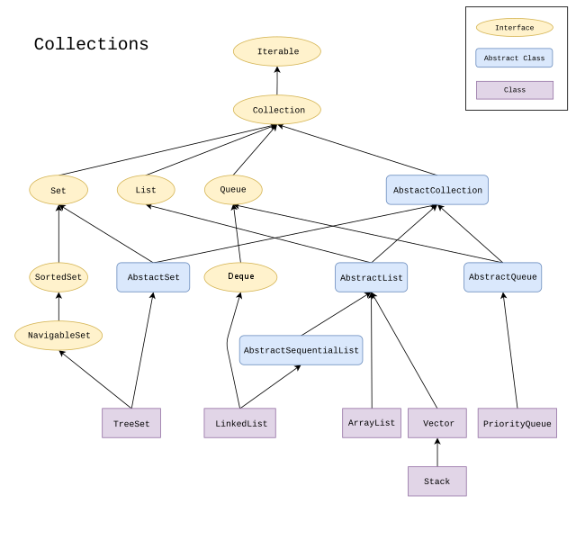
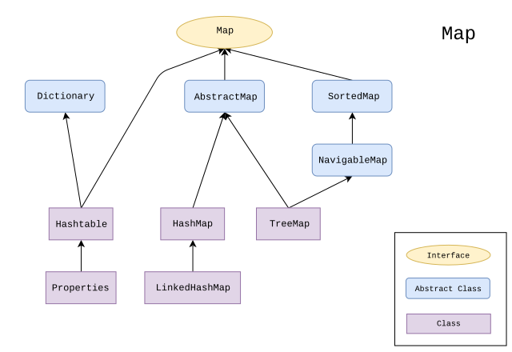

# Collections Framework 🗂️<!-- omit in toc -->

- [_Collection_-Interface und Implementationen](#collection-interface-und-implementationen)
  - [Listen und Implementationen von `List`](#listen-und-implementationen-von-list)
    - [Beispiel](#beispiel)
  - [Sets und Implementationen von `Set`](#sets-und-implementationen-von-set)
    - [Beispiel](#beispiel-1)
- [Maps und Implementationen von `Map`](#maps-und-implementationen-von-map)
- [Objekt-Identität und -Gleichheit bei Sets und Maps](#objekt-identität-und--gleichheit-bei-sets-und-maps)

Das _Java Collections Framework_ stellt zahlreiche verschiedene [Datenstrukturen](https://de.wikipedia.org/wiki/Datenstruktur), aber auch nützliche Hilfswerkzeuge zur Verfügung. Die Interfaces und Klassen des Collections Framework sind alle Teil der [_Java Class Library_](https://en.wikipedia.org/wiki/Java_Class_Library) (auch: _Java Standard Library_) und somit in der [JRE](https://de.wikipedia.org/wiki/Java_Runtime_Environment) verfügbar.

Was alle Datenstrukturen im _Collections Framework_ von den primitiveren _Arrays_ unterscheidet, ist die Tatsache, dass die Anzahl der gespeicherten Elemente nicht bei der Instanziierung festgelegt werden muss. Es halndelt sich um dynamische Datenstrukturen, denen immer weitere Elemente hinzugefügt und wieder entzogen werden können.

Das gesamte Collections Framework arbeitet mit Generics (_siehe Kapitel zu Generics!_), d.h. der Datentyp der jeweils zu verwaltenden Elemende sollte/muss im Code mittels Generics festgelegt werden!

> ⚠️ Das Collections Framework ist umfangreicher, als hier dargestellt. Wir wollen uns hier nur einigen ausgewählten, wichtigen Konzepten widmen. Eine vollständige Darstellung ist bei Bedarf [hier](https://docs.oracle.com/javase/8/docs/technotes/guides/collections/overview.html), [hier](https://docs.oracle.com/javase/tutorial/collections/) oder [hier](https://duckduckgo.com/?q=java+collections+framework&ia=web) zu finden!

> 🔗 [Hier](https://en.wikiversity.org/wiki/Java_Collections_Overview#Comparison_of_Collections) findet ihr zusätzlich eine vergleichende Übersicht über die verschiedenen Collections!


## _Collection_-Interface und Implementationen

Als eine _Collection_ bezeichnet man in Java jene Datenstrukturen, die das _Collection_-Interface implementieren. Es handelt sich um verschiedene Implementationen von `List` ([Listen](https://de.wikipedia.org/wiki/Liste_(Datenstruktur))), `Set` ([Mengen](https://de.wikipedia.org/wiki/Menge_(Datenstruktur))) und `Queue` ([Warteschlangen](https://de.wikipedia.org/wiki/Warteschlange_(Datenstruktur))).

Von jeder dieser Datenstrukturen, die alle als Interfaces im Collections Framework vorhanden sind, sind unterschiedliche Implementationen möglich. Hierbei bleibt die Schnittstelle (Interface!) immer gleich - nur die Implementation, also die Art und Weise, wie die Schnittstelle bedient wird, ist verschieden. Somit sind z.B. alle Implementationen von `List` miteinander kompatibel (_dafür sind Interfaces ja auch da!_).

Wir werden uns im Folgenden auf Implementationen von `List` und `Set` beschränken.

  
> ⚠️ **Hinweis:** unvollständig!  
> _Ramlmn / [CC BY-SA](https://creativecommons.org/licenses/by-sa/4.0); Quelle: [commons.wikimedia.org](https://commons.wikimedia.org/wiki/File:Java.util.Collection_hierarchy.svg)_


### Listen und Implementationen von `List`

Eine [Liste](https://de.wikipedia.org/wiki/Liste_(Datenstruktur)) ist eine Datenstruktur, deren Elemente eine bestimmte Reihenfolge oder Sortierung haben (wie bei einem Array). Der Zugriff auf die Elemente ist über einen Index möglich und die Anzahl der Elemente bleibt für die gesamte "Lebensdauer" der Liste offen.

Zwei sehr häufig verwendete Implementationen von `List` sind `ArrayList` und `LinkedList`. Die Namen dieser Klassen weisen bereits sehr deutlich auf die Besonderheiten der Implementierung der Listen-Funktionalität hin: Während die `ArrayList` intern ein Array zur Verwaltung der Elemente verwendet, handelt es sich bei der `LinkedList` intern um eine [verkettete Liste](https://de.wikipedia.org/wiki/Liste_(Datenstruktur)). 

#### Beispiel
Erzeugen  und benutzen einer Liste (hier: `ArrayList`) für `String`-Objekte:

``` java
// Liste erzeugen und einer Variable zuweisen
List<String> words = new ArrayList<String>();

// Elemente zur Liste hinzufügen
words.add("eins");
words.add("zwo");
words.add("drei");

// Element mit Index 1 ausgeben
System.out.println(words.get(2)); 
// ganze Liste ausgeben
System.out.println(words); 
// Element mit Index 1 entfernen (und ausgeben!)
System.out.println(words.remove(1));
// ganze Liste ausgeben
System.out.println(words);
```

Dieses Beispiel zeigt die grundlegendsten Methoden einer Liste: `add()`, `get()` und `remove()`. Die Konsolen-Ausgabe für diesen Code sieht wie folgt aus:

```
drei
[eins, zwo, drei]
zwo
[eins, drei]
```

Nun fällt direkt etwas ins Auge: Es wird eine Variable für `List` typisiert, aber eine `ArrayList` wird zugewiesen. Der Grund dafür, dass das funktioniert, ist simpel: Eine `ArrayList` implementiert `List` und **ist** somit eine `List`. Aber warum tut man das? Nun, man signalisiert damit im Code, dass es um die Funktionalität einer Liste geht - nicht speziell um eine `ArrayList`. Außerdem könnte man der selben Variable später auch eine `LinkedList` zuweisen - denn diese ist ja auch eine `List`.

Der **exakt gleiche Code** würde auch mit einer `LinkedList` funktionieren:

``` java
List<String> words = new LinkedList<String>();
// und so weiter ...
```

Aber wann benutzt man die eine und wann die andere Liste? Das kommt ganz darauf an, _was man mit der Liste vor hat_: Eine `ArrayList` benutzt, wie oben erwähnt, intern ein Array zur Verwaltung ihrer Elemente. Dadurch hat sie bestimmte Stärken und Schwächen: Ein Array ist sehr schnell darin, ein Element an einem bestimmten Index zurückzugeben. Eine verkettete Liste überhaupt nicht. Ein Aufruf von z.B. `list.get(3023)` würde bei einer `LinkedList` also bedeutend länger dauern! Auf der anderen Seite hat ein Array eine feste Größe, wodurch das interne Array einer `ArrayList` ständig durch ein größeres ersetzt werden muss, wenn viele Elemente hinzugefügt werden. Das Hinzufügen vieler Elemente geht bei einer verketteten Liste (`LinkedList`) also viel schneller, denn hier muss einfach das neue Element hinten angehängt werden.

> Eine gute Ausführung dieses Unterschieds findet sich auch [hier](https://stackoverflow.com/a/322742/7399631)!

### Sets und Implementationen von `Set`

Ein [Set](https://de.wikipedia.org/wiki/Menge_(Datenstruktur)) (dt. _Menge_) ist einer "Menge" aus der Mathematik nachempfunden. Es handelt sich um eine Datenstruktur, die keine Duplikate (doppelt vorkommenden Elemente) enthalten kann. Außerdem ist der gezielte Zugriff auf einzelne Elemente nicht möglich, da diese "von außen" nicht einzeln adressierbar sind.

Die Stärken und damit Anwendungsgebiete von Sets liegen somit in der Überprüfung, ob ein bestimmtes Element enthalten ist sowie in der Bildung von Schnitt-, Unter-, Differenz- und Teilmengen.

Die wohl am häufigsten genutzte Implementation von `Set` ist das `HashSet`. Es ist extrem schnell im Überprüfen der Anwesenheit von bestimmten Elementen, da es intern die Elemente in einer `HashMap` abbildet, in der sie über ihren jeweiligen [Hash-Wert](https://de.wikipedia.org/wiki/Hashfunktion) angesprochen werden. Das `HashSet` arbeitet also mit einer Art hocheffizientem Inhaltsverzeichnis. Die Elemente eines `HashSet` haben keine feste/natürliche Reihenfolge (auf die man sich verlassen könnte).

#### Beispiel

``` java
// Set erzeugen und einer Variable zuweisen
Set<String> numberWords1 = new HashSet<String>();

// Elemente (teilweise doppelt!) hinzufügen
numberWords1.add("eins");
numberWords1.add("eins");
numberWords1.add("zwo");
numberWords1.add("zwo");
numberWords1.add("drei");

// Inhalt des Sets ausgeben
System.out.println("Erstes Set: " + numberWords1);
```

Die Ausgabe `Erstes Set: [zwo, eins, drei]` zeigt deutlich, dass das Set keine Duplikate zulässt. Erweitern wir das Beispiel um ein weiteres Set, dessen Inhalt sich **teilweise** unterscheidet und bilden dann eine _Schnittmenge_:

``` java
// weiteres Set erzeugen
Set<String> numberWords2 = new HashSet<String>();

// Elemente (teilweise doppelt!) hinzufügen
numberWords2.add("zwo");
numberWords2.add("zwo");
numberWords2.add("drei");
numberWords2.add("vier");
numberWords2.add("vier");

// Inhalt des zweiten Sets ausgeben
System.out.println("Zweites Set: " + numberWords2);

// Schnittmenge der beiden Sets bilden
numberWords1.retainAll(numberWords2); // alle entfernen, die nicht in 2 sind
numberWords2.retainAll(numberWords1); // alle entfernen, die nicht in 1 sind

// Inhalt der Schnittmenge (numberWords2) ausgeben
System.out.println("Schnittmenge: " + numberWords2);
```

Die Ausgabe des gesamten Codes wäre dann ...

```
Erstes Set: [zwo, eins, drei]
Zweites Set: [zwo, vier, drei]
Schnittmenge: [zwo, drei]
```

Eine andere Variante des `Set` ist das `TreeSet`, welches `SortedSet` implementiert (_siehe Grafik oben!_) und dessen Elemente deshalb eine feste Reihenfolge/Sortierung haben!

## Maps und Implementationen von `Map`

Das _Map_-Interface ist zwar nicht Teil der Hierarchie unter dem _Collection_-Interface, dennoch werden _Maps_ zum Collection Framework gezählt.

Eine [_Map_](https://docs.oracle.com/javase/7/docs/api/java/util/Map.html) ist eine Datenstruktur, die Schlüssel-Wert-Paare verwaltet. Dabei können sowohl Schlüssel, als auch Wert von einem beliebigen (komplexen) Datentyp sein, der mittels Generics festgelegt wird.  
Ein Beispiel für Schlüssel-Wert-Paare wäre etwa eine Sammlung von Postleitzahlen, denen Ortsnamen zugeordnet sind (Schlüssel und Wert wären hier Strings, denn Postleitzahlen können mit einer führenden `0` beginnen, die bei `Integer` wegfiele) ...

```
16321: Bernau b. Berlin
50825: Köln
51069: Köln
```

... und so weiter. Oder etwa die Häufigkeit von Wörtern in einem Text (`String: Integer`):

```
BAUM: 4
HAUSRATVERSICHERUNG: 1
UND: 2634677
```


> _Ramlmn / [CC BY-SA](https://creativecommons.org/licenses/by-sa/4.0); Quelle: [commons.wikimedia.org](https://commons.wikimedia.org/wiki/File:Java.util.Map_hierarchy.svg)_


**Beispiel:**

```java
// neue HashMap erzeugen
Map<String, String> map = new HashMap<String, String>();

// einige Einträge hinzufügen
map.put("Musterfrau, Maximiliane", "0221/1234567894");
map.put("Mustermann, Max", "0162/14374566346");
map.put("Mustermann, Max", "01234/56789"); // Schlüssel bereits vorhanden! Wert wird ersetzt!
map.put("Otto Normal", "01234135/374237642");
map.put("Mario Rossi", "0174/1035982");

// gesamte Map auf der Konsole ausgeben
System.out.println(map);

System.out.println(""); // Leerzeile

// einen bestimmten Wert auf der Konsole ausgeben
System.out.println(map.get("Mustermann, Max"));

System.out.println(""); // Leerzeile

// Iterieren über Set von Einträgen (Map.Entry)
for(Entry<String, String> e : map.entrySet()) {
    System.out.println(e.getKey() + ": " + e.getValue());
}

System.out.println(""); // Leerzeile

// Iterieren über Schlüssel-Set
for(String key : map.keySet()) {
    System.out.println(key + ": " + map.get(key));
}
```

Konsolen-Ausgabe:

```
{Musterfrau, Maximiliane=0221/1234567894, Otto Normal=01234135/374237642, Mario Rossi=0174/1035982, Mustermann, Max=01234/56789}

01234/56789

Musterfrau, Maximiliane: 0221/1234567894
Otto Normal: 01234135/374237642
Mario Rossi: 0174/1035982
Mustermann, Max: 01234/56789

Musterfrau, Maximiliane: 0221/1234567894
Otto Normal: 01234135/374237642
Mario Rossi: 0174/1035982
Mustermann, Max: 01234/56789
```


## Objekt-Identität und -Gleichheit bei Sets und Maps

Sets lassen, wie erwähnt, [keine Duplikate zu](https://docs.oracle.com/javase/8/docs/api/java/util/Set.html#add-E-). Auch die Schlüssel in einer Map [_müssen_ unik sein](https://docs.oracle.com/javase/8/docs/api/java/util/Map.html#put-K-V-). Wann zwei Elemente (oder Schlüssel) _gleich_ sind, entscheidet die `equals()`-Methode: Ein Objekt `o1` _gleicht_ einem Objekt `o2`, wenn `o1.equals(o2) == true`. Genau dafür ist `equals()` ja auch da! Duplikate sind also _gleich_, nicht aber unbedingt _identisch_, also wirklich die _selben_ Objekte!

> 💬 **Eine Ausnahme** von dieser Regel stellen die (extrem selten verwendeten) Klassen `IdentityHashSet` und `IdentityHashMap` dar: Diese vergleichen tatsächlich mittels `==`, was wirklich sehr selten (wenn nicht fast nie) der richtige Weg ist.

Bei der Benutzung von `HashSet` oder `HashMap`, also jenen Implementationen von `Set` und `Map`, welche die Hash-Werte von Objekten nutzen, fällt dem [Vertrag zwischen `equals()` und `hashCode()`](https://www.programcreek.com/2011/07/java-equals-and-hashcode-contract/) eine besondere Bedeutung zu: Diese Datenstrukturen organisieren ihre Elemente zunächst nach deren Hash-Werten. Nur wenn zufällig ein angefordertes Element (etwa via `contains()` oder `get()`) den selben Hash-Wert besitzt, wie ein Element in der Datenstruktur, wird von einer "Gleichheit" ausgegangen. Wenn also eine Klasse zwar `equals()` korrekt implementiert, nicht aber `hashCode()`, dann ist der Vertrag gebrochen und es kann zu Komplikationen kommen, da dann zwei Objekte, die nach `equals()` gleich wären von `HashSet` und `HashMap` dennoch nicht als gleich angesehen werden.


