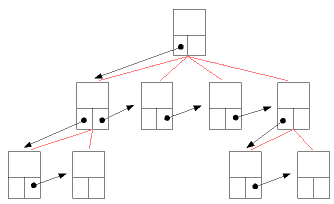
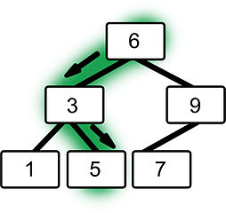

# Datenstrukturen 🗄️<!-- omit in toc -->

> ⚠️ **Wichtig:** Dies ist ein Kapitel über verschiedene Arten von Datenstrukturen (_nicht_ Daten**typen**!) und wie sie in Java implementiert sind bzw. werden können. Die Liste ist aber natürlich [**keineswegs vollständig**](https://en.wikipedia.org/wiki/List_of_data_structures)! Es soll hier wirklich nur um jene Datenstrukturen gehen, die häufig im normalen, alltäglichen Gebrauch sind bzw. um "Klassiker", die sich gut zum Lernen einer Programmiersprache selbst implementieren lassen. Ebenfalls enorm wichtige Datenstrukturen (wie etwa [_Heap_](https://de.wikipedia.org/wiki/Heap_(Datenstruktur)) oder [_Stack_](https://de.wikipedia.org/wiki/Stapelspeicher) zur Speicherverwaltung) werden hier bewusst ausgespart, weil sie eher zu den IT-Grundlagen gehören, als in einen Java-Wegweiser.

Eine 👉 [Datenstruktur](../Glossar.md#datenstruktur) ist ein Objekt, das Daten oder andere Objekte speichert bzw. referenziert. Es gibt zahlreiche Arten von Datenstrukturen, die sich jeweils in Aufbau und Funktionsweise (und somit in Vor- und Nachteilen) stark unterscheiden. Dieser Artikel thematisiert nur einige grundlegende Datenstrukturen, die sich sehr schön selbst in Java implementieren lassen.

> 💬 Für eine **umfangreiche Übersicht** über viele verschiedene Datenstrukturen sei 🔗[auf diese Seite verwiesen](https://www.geeksforgeeks.org/data-structures/)!

- [Listen](#listen)
  - [(Einfach) Verkettete Listen](#einfach-verkettete-listen)
  - [Zweifach verkettete Listen](#zweifach-verkettete-listen)
- [Bäume](#bäume)
  - [Binäre Suchbäume](#binäre-suchbäume)
- [`Iterable` und `Iterator`](#iterable-und-iterator)


## Listen

Eine Liste ist ein abstraktes Konzept einer Datenstruktur, deren Elemente eine stabile Reihenfolge besitzen, mehrfach vorkommen können und keine durch die Definition der Liste beschränkte Anzahl haben.  
Es sollen hier als Beispiel für selbst implementierte Listen-Strukturen die verketteten Listen vorgestellt werden - für die in der _Java Class Library_ verfügbaren Implementationen von Listen, siehe Artikel zum 🔭 [Collections Framework](Collections-Framework.md)!


### (Einfach) Verkettete Listen

> 💬 Es ist hier die Rede von _einfach verketteten Listen_. Im nächsten Abschnitt werden (darauf aufbauend) _zweifach verkettete Listen_ besprochen.

Bei einer verketteten Liste handelt es sich um eine sehr einfache Datenstruktur, bei der die Daten sogenannten _Knoten_ (engl.: _nodes_) zugeordnet sind. Diese Knoten bilden die eigentliche verkettete Liste (zusammen mit einem Start-Verweis auf den ersten Knoten!).  

Ein einzelner Knoten besteht dabei aus nur zwei Elementen: Dem Datenfeld und einem Verweis (_Referenz_) auf den **nächsten** Knoten (Verkettung!):

  
Beispiel: _Verkettete Liste mit Integer-Werten; Löschung eines Knotens_

Somit "kennt" ein Knoten immer nur den von ihm aus nächsten Knoten in der Liste. Soll ein Knoten aus der Liste entfernt werden, muss nur die Referenz auf diesen Knoten (ausgehend vom Knoten davor) auf den **nächsten** Knoten abgeändert werden (siehe Grafik oben).

In Java sähe eine sehr einfache Implementation einer Verketteten Liste (mit Integer-Werten) etwa so aus:

```java
public class Node {

    public int value;
    public Node next;

    public Node (int value){
        this.value = value;
    }

}
```

> 💬 Auf private Klassenattribute sowie Getter und Setter wurde zugunsten der Übersichtlichkeit hier verzichtet. _Eigentlich_ sollte natürlich beides vorhanden sein!

Aus Instanzen dieser simplen Klasse lässt sich bereits eine verkettete Liste konstruieren:

```java
Node first = new Node(12); // Start-Knoten
first.next = new Node(99); // zweiter Knoten
first.next.next = new Node(37); // dritter Knoten
```

Auch das Entfernen des zweiten Knotens (wie in der Grafik oben) ist wie beschrieben möglich:

```java
first.next = first.next.next;
```

Da nun keine Referenz auf den zweiten Knoten mehr existiert, ist dieser effektiv "entfernt" - d.h. das Objekt wird irgendwann vom [Garbage Collector](https://de.wikipedia.org/wiki/Garbage_Collection) der JVM entsorgt.

Dieses effiziente Entfernen von Elementen ist einer der **Vorteile** von verketteten Listen. Ein weiterer ist die "von Natur aus" unbegrenzte Anzahl von Elementen, denn die Knoten-Objekte sind nicht linear im Speicher abgelegt, sondern können irgendwo verteilt gespeichert sein, solange sie einander referenzieren.

Allerdings werden im obigen Beispiel auch die **Nachteile** von verketteten Listen deutlich: Einzelne Elemente lassen sich **nur über die Referenz vom Vorgänger-Knoten** ansprechen. Soll also ein Knoten mit einem ganz bestimmten Wert (oder etwa der `n`-te Knoten der Liste) gefunden werden, muss linear über die Liste iteriert werden, bis der gesuchte Knoten gefunden ist. Eine sehr teuere Operation!


### Zweifach verkettete Listen

Ausgehend von _einfach verketteten Listen_ (siehe oben!) lassen sich _zweifach verkettete Listen_ als eine konzeptuelle Erweiterung beschreiben, bei der jeder Knoten nicht nur den Folgeknoten, sondern auch den Vorgänger-Knoten referenziert. Somit kann (von jedem Knoten aus) die Liste in beide Richtungen durchlaufen werden:

  
Beispiel: _Zweifach verkettete Liste mit Integer-Werten_

Eine entsprechende Klasse sähe (wieder vereinfacht ohne private Klassenattribute!) etwa so aus:

```java
public class Node {

    public int value;
    public Node previous;
    public Node next;

    // Konstruktor für Wert, etc. ...
}
```

Dadurch lassen sich bestimmte Operationen einfacher ausführen - etwa das Entfernen eines Knotens mit einem bestimmten Wert, denn der zu entfernende Knoten referenziert selbst die beiden Nachbarknoten, deren Referenzen (auf den zu löschenden Knoten) geändert werden müssen!


## Bäume

Ein [Baum](https://de.wikipedia.org/wiki/Baum_(Datenstruktur)) ist (u.a.) eine hierarchische Datenstruktur, die (ähnlich wie die verkettete Liste) Daten in Knoten speichert. Ein Knoten speichert außerdem Verweise auf die Knoten, die in der Baumstruktur direkt unter ihm liegen. Diese Verweise werden auch _Kanten_ genannt. Ein Baum besitzt außerdem eine _Wurzel_ (oder: _Wurzelknoten), die ganz oben in der Hierarche steht.

  
> _Quelle: [commons.wikimedia.org](https://commons.wikimedia.org/wiki/File:Allgemeiner-baum.png); Matthias Kleine / [CC BY-SA](http://creativecommons.org/licenses/by-sa/3.0/)_

Es existieren viele Arten von spezialisierten Baumstrukturen - an dieser Stelle wollen wir aber nur auf die binären Suchbäume hinaus, da sich mit ihnen sehr gut weitere interessante Konzepte veranschaulichen und üben lassen (👉 [Rekursion](Rekursion.md)). 

### Binäre Suchbäume

Ein [_Binärbaum_](https://de.wikipedia.org/wiki/Bin%C3%A4rbaum) ist ganz einfach ein Baum, dessen Wurzel und Knoten **maximal zwei Kind-Knoten** (also zwei Referenzen auf darunterliegende Knoten / Nachkommen) besitzen.

Eine spezialform von Binärbäumen sind [_binäre Suchbäume_](https://de.wikipedia.org/wiki/Bin%C3%A4rer_Suchbaum). Diese werden bereits sortiert befüllt, d.h. es gibt eine Regel zum Einfügen von neuen Knoten, die jedem neu einzufügenden Knoten genau seinen Platz zuweisen. Nach dieser Regel ist die Baumstruktur anschließend sehr effizient durchsuchbar (👉 [divide and conquer](https://de.wikipedia.org/wiki/Teile_und_herrsche_(Informatik)); [Rekursion](Rekursion.md)). Diese Regel besagt, dass der linke Nachkomme (linke Referenz auf Kind-Knoten) einen kleineren oder gleichen Wert enthalten muss und jeder rechte Nachkomme (rechte Referenz...) einen größeren oder gleichen Wert enthalten muss:

  
> _Quelle: [commons.wikimedia.org](https://commons.wikimedia.org/wiki/File:Bin%C3%A4rBaum_Suchbaum.jpg); Mhombach / [CC BY-SA](https://creativecommons.org/licenses/by-sa/3.0)_ 

Wenn ein Binärbaum nach dieser Regel aufgebaut ist, dann halndelt es sich um einen binären Suchbaum. Dieser Aufbau ermöglich nun eine sehr schnelle Suche nach einem bestimmten Knoten, da nach dem "[_divide and conquer_](https://de.wikipedia.org/wiki/Teile_und_herrsche_(Informatik))"-Prinzip nur ein sehr kleiner Teil des Baumes durchsucht werden muss. In der Grafik oben ist etwa der Pfad zum Knoten (bzw. Blatt) mit dem Wert `5` hervorgehoben. Der Ablauf dieser Suche ist bei jedem Knoten mit dem Wert `n` (egal welchen Wert er trägt) gleich:

1. Ist `n` der gesuchte Wert?
   - Wenn **ja**: _FERTIG!_.
   - Wenn **nein**: Weiter zu Schritt 2.
2. Ist der gesuchte Wert größer als `n`?
   - Wenn **ja**: Weiter zum _linken_ Teilbaum mit Schritt 1.
   - Wenn **nein**: Weiter zum _rechten_ Teilbaum mit Schritt 1.
3. Der gesuchte Wert ist nicht im Baum enthalten 😒

Dieser Vorgang eignet sich natürlich hervorragend für eine [rekursive Implementierung](Rekursion.md)!


## `Iterable` und `Iterator`

> 🚧 **TODO:** `Iterable` und `Iterator`


