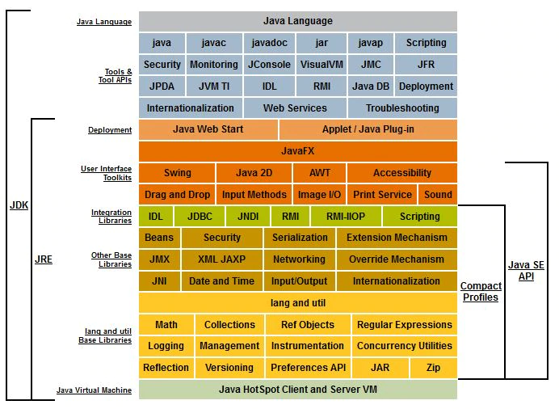

# Die Programmiersprache Java :coffee:

Java ist eine _C-artige_, [universelle](https://de.wikipedia.org/wiki/Turing-Vollst%C3%A4ndigkeit) Programmiersprache. Das bedeutet, dass die [Syntax](https://de.wikipedia.org/wiki/Syntax) derer der Programmiersprache _C_ ähnelt. Das Einsatzgebiet von Java ist nicht auf einen bestimmten Bereich der IT beschränkt. Es gibt aber noch viel mehr zu wissen...

## Besonderheiten

### Objektorientierung
Java ist eine ([beinahe](https://de.wikipedia.org/wiki/Java_(Programmiersprache)#Objektorientierung)) völlig [objektorientierte Programmiersprache](https://de.wikipedia.org/wiki/Objektorientierte_Programmierung). Mehr dazu erfährst du in den entsprechenden Kapiteln zur [_Objektorientierung_](/README.md#objektorientierte-programmierung-oop).

### Bytecode in der virtuellen Maschine
Java-Programme werden (üblicherweise) nicht direkt in Maschinen-Code übersetzt und können somit nicht [nativ](https://de.wikipedia.org/wiki/Mobile_App#Native_Apps) auf einem Computer ausgeführt werden, sondern laufen in einer virtuellen Maschine. _Mehr dazu weiter unten!_

### Garbage Collector
Eine JVM verfügt über einen [Garbage Collector](https://de.wikipedia.org/wiki/Garbage_Collection), also eine automatische Speicherbereinigung. In Java müssen deshalb vom Code nicht mehr verwendete (referenzierte) Daten und Objekte nicht "händisch" aus dem Speicher gelöscht werden - dies geschieht automatisch.

## Java-Platform

> _Grafik: [#](../assets/images/Java-Platform-Diagram.png);
Quelle: [oracle.com](https://www.oracle.com/technetwork/java/javase/tech/index.html);
Mehr dazu: [Wikipedia](https://de.wikipedia.org/wiki/Java_Platform,_Standard_Edition)_

### JRE
Die **J**ava **R**untime **E**nvironment (dt. _Java Laufzeitumgebung_) bezeichnet all das, was ein fertig [kompiliertes](https://de.wikipedia.org/wiki/Compiler) Java-Programm braucht, um ausgeführt werden zu können.  
Sie umfasst (unter anderem) die benötigten **Java-Programmbibliotheken** (_siehe unten!_) und die **JVM** (_siehe unten!_).

### JDK
Das **J**ava **D**evelopment **K**it (dt. _Java-Entwicklungspaket_ :thinking:) umfasst die oben erwähnte **JRE** sowie den Quellcode der Java Class Library (_siehe unten!_) und die Entwicklungswerkzeuge zum Entwickeln von Java-Programmen ([Compiler](https://de.wikipedia.org/wiki/Compiler), etc.).

### JVM und Bytecode
Java-Programme laufen in einer [virtuellen Maschine](https://de.wikipedia.org/wiki/Virtuelle_Maschine), der _JVM ([Java Virtual Machine](https://de.wikipedia.org/wiki/Java_Virtual_Machine))_. Dies ist eine Software, die auf dem Zielsystem installiert sein muss. Da die JVM für alle gängigen Betriebssysteme (und von ganz [unterschiedlichen Anbietern](https://en.wikipedia.org/wiki/List_of_Java_virtual_machines)) verfügbar ist, sind Java-Programme theoretisch Betriebssystem-unabhängig - solange nicht auf plattformspezifische Funktionen zugegriffen wird. Es ist jedoch auch möglich, Java-Programme direkt für die Ausführung auf einem [bestimmten Betriebssystem zu kompilieren](https://de.wikipedia.org/wiki/Java_(Programmiersprache)#Native_Compiler) - natürlich aber nur auf Kosten der Plattform-Unabhängigkeit der kompilierten Programme.

Damit ein Java-Programm in einer JVM ausgeführt werden kann, muss es (statt in [Maschinencode](https://de.wikipedia.org/wiki/Maschinensprache), also in Code, den das Zielsystem direkt verarbeiten kann) in sogenannten Java-[Bytecode](https://de.wikipedia.org/wiki/Bytecode) kompiliert werden. Dieser Code kann dann von der JVM ausgeführt werden.

Eine rohe, unkompilierte Java-Quelltextdatei hat die Endung `.java` - nach dem Kompilieren zu Bytecode die Endung `.class` (denn in Java ist alles irgendwie Teil einer Klasse).

### Java Class Library
Als [_Java Class Library_](https://en.wikipedia.org/wiki/Java_Class_Library) (auch: _Java Standard Library_) bezeichnet man die sehr umfangreiche Programmbibliothek, die fester Teil der Java-Plattform und somit in jeder JRE verfügbar ist.

> :construction: **TODO:** Irgendeine schöne Übersicht über die _JCL_?

<!-- Dieses HTML-Snippet sollte am Ende jeder Seite stehen! -->

    <a href="#" title="Zum Anfang scrollen!">Top :balloon:</a>
     
    <a href="https://dh-cologne.github.io/java-wegweiser#inhalt-book" title="Zurück zur Übersicht!">Inhalt :book:</a>

