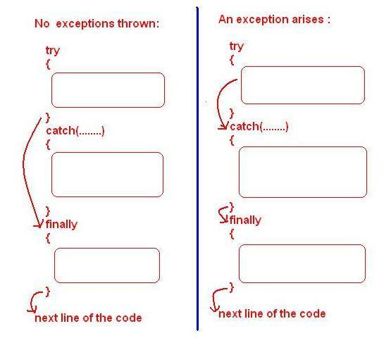

# Fehlerbehandlung ❌<!-- omit in toc -->

- [Throwable](#throwable)
- [Errors](#errors)
- [Exceptions](#exceptions)
- [try-catch-finally](#try-catch-finally)
- [throws](#throws)
- [try-with-resources](#try-with-resources)
- [Weiterführende Links](#weiterführende-links)


## Throwable
In Programmen können verschiedene Fehler auftreten. All diese Fehler sind (auf höchster Ebene) durch das Interface `Throwable` repräsentiert (siehe Grafik unten!). Der Name kommt daher, dass man auch sagt, ein auftretender Fehler wird "_geworfen_" (eng. _thrown_). D.h. das Programm teilt mit, dass an einer bestimmten stelle des Codes ein Fehler aufgetreten ist. Man unterscheidet zwischen zwei Arten von Fehlern: **Errors** und **Exceptions** (siehe auch hier Grafik unten!).

  
> _Quelle: [programcreek.com](http://www.programcreek.com/2009/02/diagram-for-hierarchy-of-exception-classes/)_


## Errors

**Errors** sind Fehler, die _nicht aufgefangen werden können_ (_catch_), d.h. das Programm kann nicht konstruktiv auf sie reagieren. Sie bringen das Programm unweigerlich zum Absturz. Sie entstehen etwa durch fehlende Systemressourcen. Beispiele hierfür sind `OutOfMemoryError` (mehr 🔗 [hier](https://docs.oracle.com/javase/8/docs/technotes/guides/troubleshoot/memleaks002.html)) oder `StackOverflowError` (mehr 🔗 [hier](https://dzone.com/articles/stackoverflowerror-causes-amp-solutions)).

```java
// dieser Code führt zu einem OutOfMemoryError
String s = "ThisWillThrowAnError";
while(true) {
	s += s;
}
```

```java
// das Aufrufen dieser Methode führt zu einem StackOverflowError
public static void stackOverflow() {
	stackOverflow();
}
```


## Exceptions

Exceptions sind Fehler, die durch eine korrekte Fehlerbehandlung "_aufgefangen_" werden können (eng. _catch_). In diesem Fall weiß das Programm mit einem Fehler umzugehen und kann weiter ausgeführt werden. 

Es werden "_checked_" und "_unchecked_" Exceptions unterschieden: _Checked_ Exceptions sind solche Exceptions, deren mögliches Auftreten außerhalb der Kontrolle des Programmes liegen. Beispiele sind die `IllegalArgumentException` oder alle Spezialisierungen von `IOException` (siehe Grafik oben!). _Unchecked_ Exceptions hingegen ergeben sich zur Laufzeit des Programmes durch fehlerhaften oder unsauberen Code und sollten im Idealfall gar nicht erst auftreten (siehe `NullPointerException`, `IllegalArgumentException`, `ArrayIndexOutOfBoundsException`, usw. in der Grafik oben!). Sie können nicht vorhergesagt werden und lassen sich nur durch das schreiben von gutem, fehlerfreiem Code verhindern! Deshalb ist es (bis auf einige Ausnahmen) auch nicht ratsam, für _Unchecked Exceptions_ eine Fehlerbehandlung durchzuführen.

```java
// dieser Code erzeugt eine NullPointerException,
// weil auf ein Array-Element zugegriffen wird, das null ist.
String[] s = new String[2];
System.out.println(s[0].length());
```

```java
// dieser Code erzeugt eine ArrayIndexOutOfBoundsException,
// weil auf einen Array-Index zugegriffen wird, der nicht existiert.
String[] s = new String[2];
System.out.println(s[7]);
```

```java
// dieser Code erzeugt eine ArithmeticException: / by zero,
// weil durch die Zählvariable i (mit dem Wert 0) geteilt wird.
for (int i = 5; i >= -5; i--) {
	System.out.println(5 / i);
}
```

Exceptions können durch den Code bewusst "_geworfen_" (eng. _throw_), also ausgelöst, oder - um mit ihnen umzugehen - "_aufgefangen_" werden (eng. _catch_). Genau damit beschäftigen sich die folgenden Kapitel.

> 🔗 Vertiefender Artikel: [Checked and Unchecked Exceptions](https://www.baeldung.com/java-checked-unchecked-exceptions)

> 🔗 Vertiefender Artikel: [Common Java Exceptions](https://www.baeldung.com/java-common-exceptions)

## try-catch-finally

Mit einem Statement aus `try`, `catch` und `finally` wird der Umgang mit potentiellen Exceptions definiert. Ein solches Statement (siehe Beispiel unten!) wird immer dann verwendet, wenn es aufgrund einer checked Exception vom Compiler verlangt wird, oder wenn der/die Programmierer*in
damit rechnet, dass ein Code unter bestimmten Bedingungen eine Exception werfen könnte.

> 👨‍🏫 Es sollten generell **keine Runtime Exceptions** mit `try`/`catch` behandelt werden, denn diese sollten eigentlich gar nicht auftreten! Programmierfehler, die so schwerwiegend sind, dass sie das Auftreten von Runtime Exceptions zulassen, _sollten sogar zum Absturz des Programmes führen_. Diese Fehler müssen **korrigiert und vermieden** werden anstatt sie zu **behandeln**.

Der `try`-Block enthält den Code, der eine Exception verursachen könnte. Mindestens ein `catch`-Block enthält den Code, der im Falle einer bestimmten Exception ausgeführt werden soll. Ein `catch`-Block wird nur dann ausgeführt, wenn die geworfene Exception innerhalb des `try`-Blocks geworfen wird und die Art der Exception der im Kopf des `catch`-Blocks angegebenen Exception entspricht (siehe Beipspiel unten!). Der `finally`-Block (falls vorhanden, er ist optional!) enthält Code, der unabhängig von einem ausgelösten `catch`-Block **am Ende der Fehlerbehandlung** auf jeden Fall ausgeführt werden soll. Dabei spielt es keine Rolle, ob ein Fehler aufgetreten ist!

  
> _Quelle: [howtodoinjava.com](https://howtodoinjava.com/java/exception-handling/try-catch-finally/)_

Nach dem _try-catch(-finally)_-Statement wird der darauf folgende Programm-Code weiter ausgeführt. Falls im `try`-Block kein Fehler auftritt, werden alle `catch`-Blöcke ignoriert; ein etwaiges `finally` wird aber generell ausgeführt. Falls keiner der definierten `catch`-Blöcke die geworfene Exception abfängt, wird trotzdem ein evtl. vorhandener `finally`-Block ausgeführt, bevor die Exception dann von der default-Fehlerbehandlung verarbeitet wird (🔗 [StackTrace](https://en.wikipedia.org/wiki/Stack_trace) über den 🔗 [Stderr](https://en.wikipedia.org/wiki/Standard_streams#Standard_error_(stderr)) auf der Konsole ausgeben).


**Syntax und Beispiel:**

Nehmen wir den folgenden kurzen Code an, der eine neue, leere Datei erstellen soll. Die aufgerufene Methode `createNewFile()` wirft ggf. eine `IOException` (_checked_!) oder auch eine `SecurityException` (_unchecked_!):

```java
File f = new File("datei.txt");
f.createNewFile();
```

Um nun mit diesen möglichen Exceptions umzugehen, damit sie unser Programm nicht vorzeitig beenden, nehmen wir für diesen Aufruf in einem `try`/`catch`-Block eine entsprechende Fehlerbehandlung vor:

```java
File f = new File("datei.txt");

try {
    f.createNewFile();
} catch (IOException e) {
    System.err.println("Datei konnte nicht erstellt werden!");
} catch (Exception e2) {
    System.err.println("Unbekannter Fehler aufgetreten!");
}
        
System.out.println("...das Leben geht weiter!");
```

Das Programm läuft also _nach_ einer etwaigen Exception weiter! Natürlich sollte man sich in der Fehlerbehandlung genau überlegen, wie man auf den entsprechenden Fehler wirklich reagieren möchte. Statt nur eine Meldung auf der Konsole auszugeben, könnte hier z.B. ggf. vom User ein anderer Dateipfad erfragt werden (o.ä.).


## throws

Eine Methode kann explizit dazu in der Lage sein, eine bestimmte Exception zu "_werfen_". Dies wird mit dem Schlüsselwort `throws` markiert. Der Typ der Exception muss dabei angegeben werden. Methoden, in denen diese "_werfende_" Methode aufgerufen wird, _müssen_ eine Fehlerbehandlung vornehmen (Ausnahme: Exceptions vom Typ `RuntimeException`)!

```java
public String thisWillFail() throws IOException {
    return Files.readString(
        new File("this_file_doesnt_exist.haha").toPath());
}
```


## try-with-resources

> ⚠️ Die Lektüre dieses Kapitels empfiehlt sich erst, wenn die Inhalte zu [Input / Output (I/O)](IO.md) bereits bekannt sind!

Eine Spezialform der Fehlerbehandlung für im `try`-Block verwendete Ressourcen, die nach ihrer Verwendung wieder geschlossen werden müssen (etwa beim Arbeiten mit Datenströmen) ist das sog. _try-with-resources_-Statement.

Der `try`-Block deklariert die entsprechende(n) Ressource(n) (mehrere Ressourcen durch `;` getrennt möglich!) in runden Klammern nach dme `try`. Normalerweise würde man die verwendeten Ressourcen im `finally`-Block schließen - dies geschieht hier aber automatisch! Diese Form des `try`-Blocks funktioniert mit allen Ressourcen, die `java.lang.AutoCloseable` implementieren (schließt `java.lang.Closeable` ein, denn `Closeable` erweitert `AutoCloseable`).

**Beispiel Datei einlesen OHNE try-with-resources**

```java
BufferedReader br = null;
String line;

try {
	br = new BufferedReader(new FileReader("text.txt"));
	while ((line = br.readLine()) != null) {
		System.out.println("Zeile gelesen: " + line);
	}
} catch (IOException e) {
	System.out.println("IOException im try-Block: " + e.getMessage());
} finally {
	System.out.println("Ausführung finally-Block...");
	//so müsste man den Reader eigentlich schließen:
	try {
		if (br != null) {
			br.close();
		}
	} catch (IOException e) {
		System.out.println("IOException im finally-Block: " + e.getMessage());
	}
}
```

**Beispiel Datei einlesen MIT try-with-resources**

```java
String line;

try (BufferedReader br = new BufferedReader(new FileReader("text.txt"))) {
	while ((line = br.readLine()) != null) {
		System.out.println("Zeile gelesen: " + line);
	}
} catch (IOException e) {
	System.out.println("IOException im try-Block: " + e.getMessage());
}
```


## Weiterführende Links
- [Difference Between Error and Exception in Java](https://techdifferences.com/difference-between-error-and-exception.html)
- [ORACLE Lesson: Exceptions](https://docs.oracle.com/javase/tutorial/essential/exceptions/)
- [List of Java Exceptions](https://programming.guide/java/list-of-java-exceptions.html)


