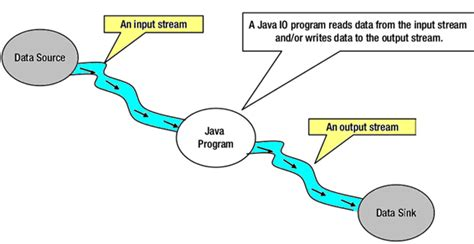

# Input / Output (I/O) ⏩<!-- omit in toc -->

> 🚧 **TODO:** Alles...

- [Datenströme](#datenströme)
  - [Byte Streams](#byte-streams)
  - [Character Streams](#character-streams)
- [Buffering](#buffering)
- [Objekt-Serialisierung](#objekt-serialisierung)
  - [`ObjectInputStream` und `ObjectOutputStream`](#objectinputstream-und-objectoutputstream)
  - [Das Interface `Serializable`](#das-interface-serializable)
  - [Beispiel](#beispiel)
- [Scanner](#scanner)
- [User-Input über Stdin via Scanner](#user-input-über-stdin-via-scanner)


## Datenströme

> eng.: _streams_

> ⚠ Dieser Abschnitt setzt voraus, dass du bereits weißt, was ein [Datenstrom](https://de.wikipedia.org/wiki/Datenstrom) ist. Hier geht es dann um den _Umgang mit Datenströmen in Java_!

> ⚠ Hier geht es übrigens _**nicht**_ um die [Java](https://docs.oracle.com/javase/8/docs/api/java/util/stream/Stream.html) [Stream](https://www.baeldung.com/java-8-streams) [API](https://stackoverflow.com/questions/44180101/in-java-what-are-the-advantages-of-streams-over-loops), sondern um Input/Output-Streams, also **Datenströme**!


Quelle: [java-latte.blogspot.com](http://java-latte.blogspot.com/2014/10/nio-tutorial-in-java-with-example-and-nio2-feature.html)

Die Java Standard-Library bietet zahlreiche Klassen für den Umgang mit Datenströmen. Diese lassen sich in zwei Gruppen aufteilen:

1. **Streams:** Hierbei handelt es sich um sog. _Byte Streams_. Sie transportieren Daten in "Portionen" von aufeinander folgenden Bytes, also 8-Bit-Blöcken 🤓
2. **Readers / Writers:** Dies sind sog. _Character Streams_. Sie sind speziell für textbasierte Daten gedacht, die Zeichen für Zeichen unter berücksichtigung lokaler Zeichensätze verarbeitet werden.

> 💬 Wir schauen uns hier die Klassen aus dem älteren Paket `java.io` an, weil diese (1.) ihren Dienst tun und (2.) alles bieten, was man für einfache Operationen mit Datenströmen und Puffern benötigt. Eine neuere (aber als Ergänzug gedachte) Schnittstelle zur Arbeit mit Dateien, Pfaden und Datenströmen bietet übrigens das Paket 🔗 [`java.nio`](https://en.wikipedia.org/wiki/Non-blocking_I/O_%28Java%29). Die Klasse 🔗 [`Files`](https://www.journaldev.com/17794/java-files-nio-files-class) etwa besitzt einige statische Methoden wie `Files.write(...)`, die man sich ebenfalls ansehen sollte!


### Byte Streams

Alle 🔗 [_Byte Stream_](https://docs.oracle.com/javase/tutorial/essential/io/bytestreams.html)-Klassen erweitern die (abstrakten) Klassen `InputStream` (Datenströme, die "von außen" kommen und von der Anwendung _gelesen_ bzw. _verarbeitet_ werden) oder `OutputStream` (Datenströme, in die von der Anwendung Daten _geschrieben_ werden).

`InputStream` und `OutputStream` werden (weil sie [abstrakte Klassen](Vererbung-II-Abstrakte-Klassen-und-Methoden.md#abstrakte-klassen) sind) nicht direkt instanziiert, sondern von unterschiedlichen auf bestimmte Daten-Quellen bzw. -Ziele spezialisierte Klassen erweitert. Zwei Beispiele sind ...

- `FileInputStream`/`FileOutputStream` zum Lesen/Schreiben von Dateien
- `ObjectInputStream`/`ObjectOutputStream` für [Objektserialisierung](#objekt-serialisierung)
- ...

Sehen wir uns zum Beispiel den Umgang mit einem `FileOutputStream` an, um einen `String` in eine Datei zu schreiben:

```java
String s = "Ich hab 'ne Schlange im Stiefel!";
File f = new File("test.txt");
FileOutputStream fos = new FileOutputStream(f);
fos.write(s.getBytes());
fos.close();
```

> ⚠ **Anmerkung:** Der Code in diesem Beispiel wirft möglicherweise eine `FileNotFoundException` oder (allgemeiner) irgendeine andere `IOException`. Zugunsten der Übersichtlichkeit ist die [Fehlerbehandlung](Fehlerbehandlung.md) in diesem Beispiel ignoriert worden - natürlich ist diese für solche Operationen aber notwendig!

Sehen wir uns die fünf Zeilen Code genauer an:

1. Einen String erzeugen / einer Variable zuweisen
2. Ein 🔗 [`File`](https://www.geeksforgeeks.org/file-class-in-java/)-Objekt erzeugen, welches die Datei _test.txt_ (relativ zum Arbeitsverzeichnis) repräsentiert (diese Datei muss dafür nicht wirklich existieren!)
3. Einen `FileOutputStream` erzeugen und diesem das `File`-Objekt im Konstruktur übergeben (damit bezieht sich unser `FileOutputStream` auf diese Datei!)
4. Den String `s` (als Array `byte[]`) in den Datenstrom `fos`, unseren `FileOutputStream`, schreiben
5. Den Datenstrom wieder schließen

Nun sollte auf der Festplatte im Arbeitsverzeichnis des gerade ausgeführten Programmes eine Datei `test.txt` mit dem Inhalt _"Ich hab 'ne Schlange im Stiefel!"_ liegen.

Analog zu diesem Beispiel funktionieren auch andere _Byte Streams_ in Java!

Eigentlich werden _Byte Streams_ eher dazu verwendet, um Daten an andere Programmteile weiterzureichen. Wenn es sich um textuelle Daten (wie in unserem Beispiel) handelt, die auch als Text im Programm verarbeitet wurden oder werden sollen, sollte man besser gleich die passendere Stream-Variante wählen, nämlich _Character Streams_ (siehe unten)!


### Character Streams

🔗 [_Character Streams_](https://docs.oracle.com/javase/tutorial/essential/io/charstreams.html) transportieren textuelle Daten. Es lohnt sich, textuelle Daten mit speziellen Werkzeugen zu verarbeiten, denn die entsprechenden Klassen (etwa `FileReader` und `FileWriter`) tun dies in 🔗 [Unicode](https://de.wikipedia.org/wiki/Unicode)-kompatibler Form (genauer in 🔗 [UTF-16](https://en.wikipedia.org/wiki/UTF-16)) und transformieren die Daten automatisch in den [lokalen Zeichensatz](https://benohead.com/blog/2013/10/31/java-character-sets-and-encoding/).

Außerdem bieten `FileReader` und `FileWriter` etwas passendere Methoden für das an, was man hier tun will - sehen wir uns, angelehnt an das Beispiel von oben, das Schreiben in eine Datei mittels `FileWriter` an:

```java
String s = "Ich hab 'ne Schlange im Stiefel!";
File f = new File("test.txt");
FileWriter writer = new FileWriter(f);
writer.write(s);
writer.close();
```

Man beachte, wie in der vierten Zeile die Methode `write()` direkt einen `String` annimmt! Die 👉 [API](../Glossar.md#api) unterscheidet sich darüber hinaus nicht zwangsläufig vom Beispiel oben. Aber wie gesagt: Der `FileWriter` schreibt diese Text-Daten unter Verwendung des im Betriebssystem festgelegten Zeichensatzes!

> 💬 Das wäre dann unter **Windows** (auf Deutsch) etwa [CP 1252](https://de.wikipedia.org/wiki/Windows-1252), unter **Linux** (und inzwischen auch unter **Mac OS X**) eher [UTF-8](https://de.wikipedia.org/wiki/UTF-8).

Möchte man den verwendeten Zeichensatz ändern, übergibt man dem `FileWriter` (bzw. `FileReader` - je nach dem) diese Information einfach im Konstruktor. Die Java-Klasse `StandardCharsets` bietet komfortablen, statischen Zugang zu den üblichsten Charsets:

```java
new FileWriter(file, StandardCharsets.UTF_8);
```


## Buffering

> deu.: _Pufferung_

Ohne eine 🔗 [Pufferung](https://de.wikipedia.org/wiki/Puffer_(Informatik)) wird jeder Schreibvorgang eines Datenstroms einzeln abgearbeitet. Dadurch werden viele unnötige Ressourcen (Dateizugriffe, Netzwerkanfragen, etc.) mobilisiert, wodurch wiederum der jeweilige Vorgang stark verlangsamt werden kann.

Um dies zu verhindern verwendet man besonders für Datenströme, die größere Datenmengen transportieren\* und dabei nicht etwa ohnehin regelmäßig auf das nächste Datenpaket warten\*, einen **Puffer**, der größere Mengen von Datenblöcken **zwischenspeichert**, die dann am Stück verarbeitet werden können. Dadurch können Vorgänge, an denen Datenströme beteiligt sind, enorm _beschleunigt_ werden.

> **\* Also etwa:** _"der gesamte Text der Bibel wird von der Festplatte gelesen"_ und **nicht** _"ein User gibt Zeile für Zeile Befehle auf der Kommandozeile ein"_ (dafür wäre keine Pufferung notwendig)

Die Puffer-Klassen für Datenströme in Java heißen ...

- `BufferedInputStream` bzw. `BufferedOutputStream` für _Binary Streams_ (siehe oben) und
- `BufferedReader` bzw. `BufferedWriter` für _Character Streams_ (siehe ebenfalls oben)

Die 👉 [API](../Glossar.md#api) für diese Puffer-Klassen ist so gestaltet, dass einfach der passende Puffer als 👉 [Wrapper](../Glossar.md#wrapper) für den genutzten Datenstrom verwendet wird. Dazu wird das Datenstrom-Objekt dem Puffer-Objekt im Konstruktor übergeben. Von da an nutzt man nur noch das Puffer-Objekt für den Zugriff auf den Datenstrom, denn dieses Verwaltet den "verpackten" Datenstrom.

In Anlehnung an das Beispiel von oben puffern wir doch einfach mal das Schreiben von Text in eine Datei:

```java
String s = "Ich hab 'ne Schlange im Stiefel!";
File f = new File("test.txt");
FileWriter writer = new FileWriter(f);
BufferedWriter bw = new BufferedWriter(writer); // Puffer!
bw.write(s); // in den Puffer schreiben
bw.close(); // Puffer schließen (schließt auch Datenstrom!)
```

> 💬 Natürlich müsste man für dieses Minimalbeispiel nicht wirklich einen Puffer verwenden!

Die anderen Puffer-Klassen funktionieren nach dem selben Prinzip.

> 🔗 Weitere Informationen und Beispiele zum Puffern von Datenströmen in Java finden sich z.B [hier](https://docs.oracle.com/javase/tutorial/essential/io/buffers.html) oder [hier](https://medium.com/@isaacjumba/why-use-bufferedreader-and-bufferedwriter-classses-in-java-39074ee1a966).


## Objekt-Serialisierung

Mit Objekt-[Serialisierung](https://de.wikipedia.org/wiki/Serialisierung) ist das Überführen von Objekten und deren Zustand in eine sequenzielle Datenstruktur (_Datenstrom!_) gemeint - meist zum Zweck der Speicherung von Objektzuständen in einer Datenbank oder als Datei.

> 👩‍🏫 Die **De**serialisierung beschreibt dementsprechend den umgekehrten Prozess!

### `ObjectInputStream` und `ObjectOutputStream`

Java hält für die Objekt-Serialisierung die beiden genau darauf spezialisierten Klassen `ObjectInputStream` und `ObjectOutputStream` bereit. Sie lesen bzw. schreiben einen Datenstrom, der Objekte und ihre Zustände in sequentieller Form (Byte für Byte) transportiert.

Ob dieser Datenstrom dann in eine Datei oder ein anderes Ziel "gelenkt" wird, hängt wieder davon ab, welchen weiteren Datenstrom wir "anschließen" (z.B: einen `FileOutputStream` zum Schreiben in eine Datei).

**Wichtig:** Es lassen sich generell nur Objekte serialisieren, deren zugrundeliegende Klasse das Interface `Serializable` implementiert (siehe nächster Abschnitt).


### Das Interface `Serializable`

Es handelt sich bei `Serializable` um ein reines _Markierungs-Interface_ (oder eng.: _marker interface_). Das bedeutet, dass es keine (!) Methoden definiert, die von einer Klasse implementiert werden müssten, sondern lediglich eine Art Versicherung der programmierenden Person darstellt, dass Instanzen dieser Klasse "serialisierbar" sein sollen.

Es gibt hinsichtlich der "Serialisierbarkeit" einer Klasse [keine technischen Einschränkungen](https://stackoverflow.com/a/16851174/7399631). Ob eine Klasse das Interface `Serializable` implementieren kann (oder _sollte_), hängt einzig davon ab, ob dies Sinn ergibt: Eine Klasse `User`, die Daten zu einem User speichert, könnte durchaus serialisierbar sein. Hingegen sollte man Instanzen einer Klasse `File` oder `Connection`, deren Zustand aus Daten zu einem Plattform- bzw. Zeit-abhängigen Sachverhalt besteht, nicht als `Serializable` markieren. Und zwar einfach, weil es nicht sinnvoll wäre.

> ⚠ Alle _Unterklassen_ einer Klasse, die `Serializable` implementert, sind automatisch ebenfalls als `Serializable` markiert (logisch, denn sie erben ja diese Eigenschaft!). Allerdings sind Klassen, die als Typ von Instanzvariablen oder als Typ von Elementen einer Datenstruktur dienen **nicht** automatisch auch `Serializable`. In diesem Fall muss `Serializable` in diesen betreffenden Klassen ebenfalls "implementiert" sein!


### Beispiel

Nehmen wir einmal an, wir haben eine Klasse `User`:

```java

```
 
... TODO


## Scanner

... TODO


## User-Input über Stdin via Scanner

Die Klasse `Scanner` kann außerdem dazu genutzt werden, um auf einfache Weise User-Input über 👉 [Stdin](../Glossar.md#stdin) (_Standard Input_) zu erhalten. Dazu wird das Java-Objekt, das diesen Datenstrom repräsentiert (`System.in`) als Parameter an den Konstruktor der `Scanner`-Klasse übergeben. Diese bietet eine sehr komfortable Schnittstelle für solche textbasierten Datenströme:

```java
Scanner in = new Scanner(System.in);
String input = in.nextLine();
System.out.println("User hat eingegeben: " + input);
in.close();
```

In einem größeren Zusammenhang könnte das etwa so aussehen:

```java
import java.util.Scanner;

class ReadingStdin {  

  public static void main(String args[]) { 
    Scanner in = new Scanner(System.in);
    String input = null;
    
    do {
        // noch kein Input vorhanden?
        if (input != null){
            // wurde "exit" oder "EXIT" eingegeben?
            if (input.equalsIgnoreCase("exit")){
                System.exit(0);
            }
            // reagieren
            System.out.println("You just typed: \"" + input + "\"\n");
        }
        // Aufforderung zur Eingabe
        System.out.print("Type something here: ");
    } while ((input = in.nextLine()) != null);
    
    // Scanner muss wieder geschlossen werden!
    in.close();
  } 
  
}
```

Das Ergebnis sieht dann so aus:

```
Type something here: Hello
You just typed: "Hello"

Type something here: World
You just typed: "World"

Type something here: █
```

