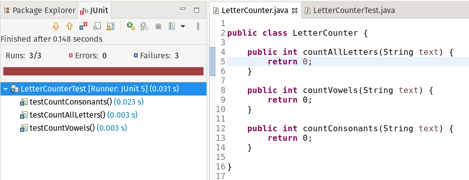
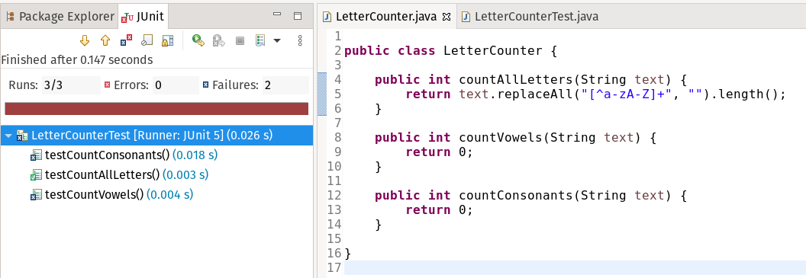
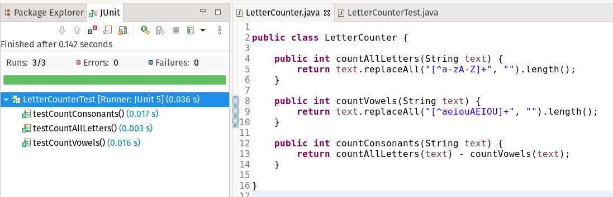

# Unit Testing mit JUnit<!-- omit in toc -->


## Unit Testing

Eine sehr wichtige und weit verbreitete Strategie, um den Quellcode eines Programms auf Fehler hin zu überprüfen, ist das sog. 🔗[Unit Testing](https://en.wikipedia.org/wiki/Unit_testing). Anders als beim 👉[Debugging](../Glossar.md#debugging), bei dem geziehlt nach der Ursache von auftretenden Fehlern gesucht wird, werden für das Unit Testing mehrere (oft auch sehr viele) sog. _Tests_ programmiert, die jeweils einzelne, funktional in sich geschlossene Bestandteile des Programmes _testen_. Diese Tests werden nun nach jeder größeren Änderung am Quellcode ausgeführt und schlagen dann entweder fehl (_fail_) oder laufen ohne Fehler durch (_pass_). Um diese Tests so aussagekräftig wie möglich zu gestalten, wird normalerweise versucht, eine große Testabdeckung zu erzielen, d.h. Tests für möglichst viele (oder gar alle) Aspekte des Programms zu schreiben. Auf diese Weise können nicht nur Fehler im gerade geänderten Code, sondern auch unerwünschte Nebeneffekte in anderen, auf diesem Code basierenden Programmteilen gefunden werden.

Unit Tests werden für gewöhnlich mit Hilfe entsprechender 🔗[Programmbibliotheken](https://de.wikipedia.org/wiki/Programmbibliothek) (_libraries_) in der selben Programmiersprache geschrieben, in der auch das zu testende Programm geschrieben wird. Das Schreiben von Tests bedeutet natürlich zusätzliche Arbeit und erfordert einige Disziplin, kann aber gerade bei größeren Projekten viele Probleme vermeiden und für eine wesentlich höhere Code-Qualität sorgen.

Eine Methode in der Software-Entwicklung, die den Einsatz von Unit Tests zur Grundlage der Programmierung macht, ist das sog. 🔗[Test Driven Development](https://de.wikipedia.org/wiki/Testgetriebene_Entwicklung), bei dem konsequent **zuerst** die Tests geschrieben werden, die das gewünschte Verhalten einer Programmkomponente definieren, um **danach** den eigentlichen Code zu schreiben, der diese Tests _bestehen_ soll.

> 👩‍🏫 Es gibt neben Unit Tests auch noch weitere Test-Strategien, die auf jeweils anderen Ebenen ansetzen, etwa 🔗[Smoke Testing](https://en.wikipedia.org/wiki/Smoke_testing_(software)) und 🔗[Integration Testing](https://en.wikipedia.org/wiki/Integration_testing).


## JUnit

> ⚠ Dieser Artikel erläutert nicht, wie sich externe Programmbibliotheken (wie JUnit) in ein Java-Programm einbinden lassen. Dieses Thema wird [hier](Programmbibliotheken.md) gesondert behandelt!

Eine sehr etablierte Open Source Programmbibliothek für Unit Tests in Java (die man als den de-facto Standard ansehen kann) ist 🔗[JUnit](https://junit.org) (gesprochen _[jäi junit]_). Sie bietet alles, was für das Schreiben von Unit Tests in Java nötig ist.

Bei einem JUnit Test handelt es sich um eine normale Java-Klasse, in der in Form von Methoden verschiedene Testfälle (_Test Cases_) zum Testen einer Programmkomponente definiert sind. Innerhalb dieser Testfälle wird jeweils eine bestimmte Funktion (meist in Form einer Methode oder ganzen Klasse) der entsprechenden Programmkomponente getestet, indem sie (ggf. unter Verwendung von Dummy-Daten) ausgeführt wird. Es wird dann überprüft, ob sie zum gewünschten Ergebnis führt.

Ein Testfall wird mit der Annotation `@Test` als solcher markiert und "behauptet" (bildlich gesprochen), dass etwa Funktion **A** unter bestimmten im Testfall festgelegten Voraussetzungen Ergebnis **X** hervorbringt. Stellt sich diese Behauptung als _wahr_ heraus, ist der Testfall bestanden, ansonsten ist er fehlgeschlagen. Das funktionert mit sog. _Asserts_ (eben _"Behauptungen"_), die JUnit in unterschiedlichster Form als statische Methoden zur Verfügung stellt. Ein Beispiel ist die Methode `assertEquals(...)`, die überprüft, ob ein Ausdruck den erwarteten Wert annimmt:

```java
@Test
void testSumMethod(){
    Calculator calc = new Calculator();
    assertEquals(5, calc.sumOf(3, 2));
}
```

In diesem (fiktiven) Beispiel wird die Methode `sumOf(...)` der Klasse `Calculator`, die zwei Zahlen addieren soll (hier: `3` und `2`), getestet. Das erwartete Ergebnis ist `5`.

Neben diesen Testfällen können JUnit Tests auch noch weitere Methoden enthalten, deren Funktionen (und weitere Eigenschaften) für den Test ebenfalls über Annotationen markiert sind. Die grundlegendsten Annotationen sind hier kurz aufgeführt (nicht vollständig!):

| Annotation | Beschreibung |
| --- | --- |
| `@Test` | Markiert eine Methode als Testfall. |
| `@BeforeAll` | Markiert eine Methode, die **ein mal vor allen Testfällen** ausgeführt wird (sollte nur einmal pro Test-Klasse vorkommen). Dies dient z.B. der Vorbereitung von Dummy-Daten o.ä. |
| `@AfterAll` | Wie `@BeforeAll`, nur eben **ein mal nach allen Testfällen**. Dient etwa dem schließen von im Test verwendeten Ressourcen o.ä. |
| `@BeforeEach` | Wird **vor jedem einzelnen Testfall jeweils ein mal** ausgeführt. |
| `@AfterEach` | Wird **nach jedem einzelnen Testfall jeweils ein mal** ausgeführt. |

> 🔗 Eine vollständige Liste zu den Annotationen von JUnit5 gibt es z.B. [hier](https://junit.org/junit5/docs/current/user-guide/#writing-tests-annotations).


Es folgt ein umfangreicheres (aber natürlich immernoch künstlich "simpel" gehaltenes) Beispiel einer Klasse, die getestet werden soll. Nehmen wir an wir wollen eine Klasse `LetterCounter` programmieren, die Methoden anbietet, um bestimmte Buchstabenklassen in beliebigen Strings zu zählen. Diese Methoden heißen `countAllLetters(String text)`, `coundVowels(String text)` und `countConsonants(String text)` und geben jeweils einen `int`-Wert mit der Anzahl der entsprechenden Buchstaben zurück.

Versuchen wir uns doch mal an 🔗[Test Driven Development](https://de.wikipedia.org/wiki/Testgetriebene_Entwicklung) und schreiben unseren Test _bevor_ wir die eigentliche Klasse programmieren:

```java
class LetterCounterTest {
	
	private LetterCounter lc;
	private String text;

	@BeforeAll
	static void setUpBeforeClass() throws Exception {
		System.out.println("Starting LetterCounter Tests ...");
	}

	@AfterAll
	static void tearDownAfterClass() throws Exception {
		System.out.println("Finished LetterCounter Tests!");
	}

	@BeforeEach
	void setUp() throws Exception {
		lc = new LetterCounter();
		text = "Hello World! The End Is Near!";
	}

	@Test
	@DisplayName("Count all letters")
	void testCountAllLetters() {
		assertEquals(22, lc.countAllLetters(text));
	}
	
	@Test
	@DisplayName("Count vowels")
	void testCountVowels() {
		assertEquals(8, lc.countVowels(text));
	}
	
	@Test
	@DisplayName("Count consonants")
	void testCountConsonants() {
		assertEquals(14, lc.countConsonants(text));
	}
}
```

Dieser Test enthält (etwas überflüssige) mit `@BeforeAll`, `@AfterAll` und `@BeforeEach` markierte Methoden, sowie drei Testfälle, die jeweils mit `@Test` markiert sind und die drei beschriebenen Methoden testen.

Wir legen nun unsere Klasse `LetterCounter` und ihre Methoden an, implementieren jedoch - zu Demonstrationszwecken - noch keine Funktionalität, sondern geben überall `0` zurück:

```java
public class LetterCounter {
	
	public int countAllLetters(String text) {
		return 0;
	}
	
	public int countVowels(String text) {
		return 0;
	}
	
	public int countConsonants(String text) {
		return 0;
	}
}
```

Wenn wir den Test nun in unserer IDE (hier: Eclipse) ausführen (Rechtsklick auf das Projekt &rarr; _Run As_ &rarr; _JUnit Test_), schlagen natürlich alle Testfälle fehl:



Fügen wir nun einer unserer Methoden funktionierenden Code hinzu:

```java
public int countAllLetters(String text) {
    return text.replaceAll("[^a-zA-Z]+", "").length();
}
```

> 👩‍🏫 `[^a-zA-Z]+` ist ein 🔗[Regulärer Ausdruck](https://de.wikipedia.org/wiki/Regul%C3%A4rer_Ausdruck), der Zeichenketten von einem oder mehr Zeichen beschreibt, die **nicht** in den angegebenen Bereichen `a-z` oder `A-Z` liegen. Diese werden mittels `replaceAll()` durch einen leeren String `""` ersetzt (entfernt). Die länge der Rückgabe (`length()`) ist dann die Anzahl aller Buchstaben von A bis Z (egal ob groß oder klein geschrieben).

Führen wir unseren Test erneut aus:



Wir sehen, dass nun einer der Testfälle erfolgreich ist. Solange aber nicht _alle_ erfolgreich sind, gilt der Test als ganzer als _fehlgeschlagen_ (_failed_).

Vervollständigen wir nun unsere Klasse:

```java
public class LetterCounter {
	
	public int countAllLetters(String text) {
		return text.replaceAll("[^a-zA-Z]+", "").length();
	}
	
	public int countVowels(String text) {
		return text.replaceAll("[^aeiouAEIOU]+", "").length();
	}
	
	public int countConsonants(String text) {
		return countAllLetters(text) - countVowels(text);
	}
}
```

Das Ergebnis:



Alle Tests erfolgreich abgeschlossen 🎉

Sollten wir (oder eine andere Person, die das selbe Projekt bearbeitet) nun zu einem späteren Zeitpunkt eine fehlerhafte Änderung an unserer Klasse vornehmen, wird unser Test uns darauf aufmerksam machen!


> 🔗 Weiterführende Ressourcen:
> - [JUnit 5 User Guide](https://junit.org/junit5/docs/current/user-guide/)
> - [A Guide to JUnit 5](https://www.baeldung.com/junit-5)