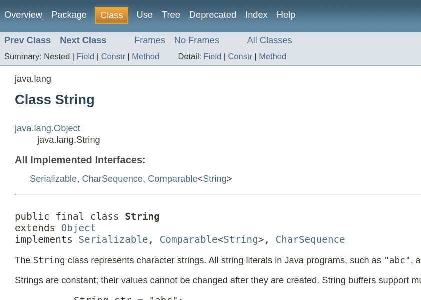
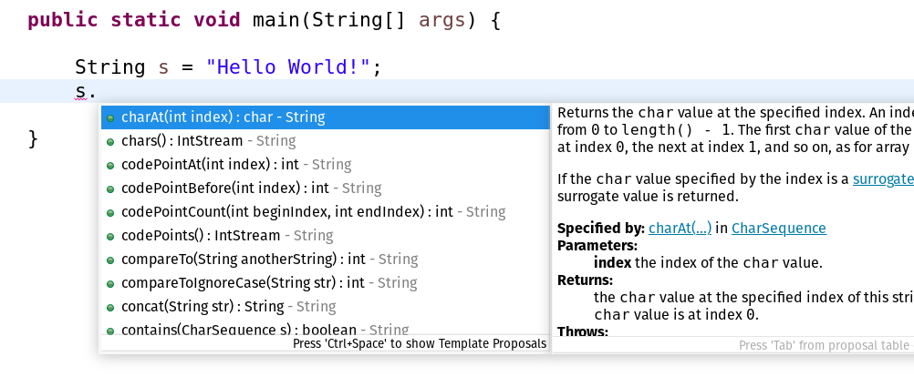
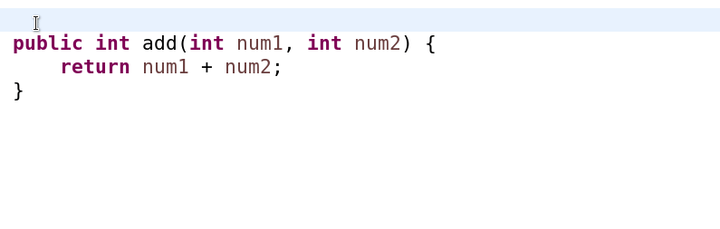

# Dokumentation mit Javadoc 📋<!-- omit in toc -->

Javadoc ist ein Dokumentationswerkzeug (und -Generator), der schon sehr lange Teil des Java-Ökosystems ist. Es ist der De-Dacto-Standard zur Dokumentation von Java-Quelltext.

- [Nutzen](#nutzen)
- [Funktionsweise](#funktionsweise)
- [Syntax](#syntax)
- [Eclipse IDE Content Assist für Javadoc](#eclipse-ide-content-assist-für-javadoc)


## Nutzen

Javadoc generiert automatisch eine Software-Dokumentation (in HTML). Das sieht dann [zum Beispiel so](https://docs.oracle.com/javase/7/docs/api/java/lang/String.html) aus:



Außerdem wird Javadoc von so ziemlich allen Java-[IDE](../Glossar.md#ide)s (und eben auch von Eclipse) dazu genutzt, schon beim Schreiben von Quelltext nützliche Informationen über die genutzten Klassen, Methoden und deren Funktionalität zu erhalten:



Javadoc ist also ein sehr effektives Werkzeug zur Dokumentation von Java-Quelltext!


## Funktionsweise

Javadoc nutzt eine spezielle Form von (annotierten) Kommentaren im Quellcode, aus denen dann die Dokumentation - sei es eine volle Doku in HTML oder eine kurze, eingeblendete Info in der IDE - erzeugt wird.

Die Schnittstelle zu Javadoc ist also extrem komfortabel und Zugänglich, weil die Dokumentation einfach teil der Quelltext-Dateien (`.java`) wird!


## Syntax

Ein Javadoc-Kommentar ist einem mehrzeiligen (Block-)Kommentar sehr ähnlich - er wird nur mit einem zusätzlichen Sternchen (Asterisken) eingeleitet:

Block-Kommentar:
```
/*
 * Ein mehrzeiliger
 * Kommentar!
 */
```

Javadoc-Kommentar:
```
/**
 * Ein Javadoc-
 * Kommentar!
 */
```

Um nun eine effektive Dokumentation zu erhalten, können Javadoc-Kommentare an die Klassen, Felder, Methoden etc. geschrieben werden, auf die sie sich beziehen. Ein Javadoc-Kommentar beginnt mit einem kurzen Freitext und kann dann mehrere Annotationen enthalten, die bestimmte Eigenschaften des dokumentierten Code-Elements beschreiben.

Nehmen wir etwa folgende, sehr primitive Methode:

```
public int add(int num1, int num2) {
    return num1 + num2;
}
```

In einer Dokumentation dieser Methode sollte folgendes _mindestens_ beschrieben werden:

- Welche Aufgabe hat die Methode? Was _tut_ sie?
- Welche Parameter nimmt die Methode entgegen und welche Anforderungen werden an diese gestellt?
- Wenn die Methode einen Rückgabetyp hat: Was wird zurückgegeben?
- Welche (implementationsbedingten) Besonderheiten im Verhalten der Methode sind zu beachten?

Und so (oder so ähnlich) könnte diese Dokumentation aussehen:

```
/**
 * Adds the passed integer values and returns the result
 * @param num1 First {@code int} value
 * @param num2 Second {@code int} value
 * @return The sum of the addition as an {@code int} value
 */
public int add(int num1, int num2) {
    return num1 + num2;
}
```

In diesem Beispiel werden die Annotationen `@param` (für Methodenparameter) und `@return` (für den Rückgabewert) verwendet.

Natürlich gibt es noch viele weitere Javadoc-Annotationen:

|Tag und Parameter|Ausgabe|Verwendung in|seit|
|--- |--- |--- |--- |
|`@author` name|Beschreibt den Autor.|Klasse, Interface||
|`@version` version|Erzeugt einen Versionseintrag. Maximal einmal pro Klasse oder Interface.|Klasse, Interface||
|`@since` jdk-version|Seit wann die Funktionalität existiert.|Klasse, Interface, Instanzvariable, Methode||
|`@see` reference|Erzeugt einen Link auf ein anderes Element der Dokumentation.|Klasse, Interface, Instanzvariable, Methode||
|`@serial`|Beschreibt die serialisierten Daten eines Serializable-Objekts.|Klasse||
|`@serialField`|Dokumentiert ein Feld eines Serializable-Objekts.|Klasse, Methode||
|`@param` name description|Parameterbeschreibung einer Methode.|Methode||
|`@return` description|Beschreibung des Rückgabewerts einer Methode.|Methode||
|`@exception` classname description `@throws` classname description|Beschreibung einer Exception, die von dieser Methode geworfen werden kann.|Methode||
|`@deprecated` description|Beschreibt eine veraltete Methode, die nicht mehr verwendet werden sollte. Sollte ab Java 5.0 immer mit der `@Deprecated`-Annotation verwendet werden.|Methode||
|`{@inheritDoc}`|Kopiert die Beschreibung aus der überschriebenen Methode.|Überschreibende Methode|1.4.0|
|`{@link reference}`|Link zu einem anderen Symbol.|Klasse, Interface, Instanzvariable, Methode||
|`{@linkPlain reference}`|Der Link wird in Standardtext statt in Quelltextzeichensatz angezeigt.|Klasse, Interface, Instanzvariable, Methode|1.4.0|
|`{@value}`|Gibt den Wert eines konstanten Feldes zurück.|Statisches Feld|1.4.0|
|`{@docRoot}`|Gibt den absoluten Pfad zum Hauptverzeichnis wieder.|Package, Klassen, Felder, Methoden||
|`{@code}`|Formatiert Text buchstabengetreu mit dem Quelltextzeichensatz (entsprechend `<code>`) und unterdrückt die Interpretierung von beinhalteten HTML oder Javadoc-Tags.|Klasse, Interface, Instanzvariable, Methode|5.0|
|`{@literal}`|Kennzeichnet buchstabengetreuen Text und unterdrückt die Interpretierung von beinhalteten HTML oder Javadoc-Tags.|Klasse, Interface, Instanzvariable, Methode|5.0|

Quelle: 🔗 [Wikipedia](https://de.wikipedia.org/wiki/Javadoc#%C3%9Cbersicht_der_Javadoc-Tags)


## Eclipse IDE Content Assist für Javadoc

Die Eclipse IDE bietet (neben vielen anderen) eine nette Funktion zur automatischen Vervollständigung von Javadoc-Kommentaren: Wenn man etwa die Zeichenkette `/**` in die Zeile vor eine Methode schreibt und dann mit ENTER die Zeile umbricht, erstellt Eclipse automatisch eine Vorlage für einen Javadoc-Kommentar mit passenden `@param` und `@return` Annotationen. Das funktioniert natürlich nicht nur bei Methoden.




> 🔗 Ein vollständige Dokumentation von Javadoc findet ihr [hier](https://docs.oracle.com/javase/8/docs/technotes/tools/windows/javadoc.html) (extrem lang)

> 🔗 Eine weitere Anleitung zu Javadoc findet ihr z.B. [hier](https://www.baeldung.com/javadoc) (schon besser)


