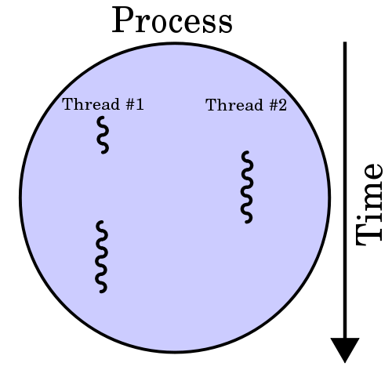

# Multithreading 🧵<!-- omit in toc -->

> 👉 Siehe Definitionen für [Multitasking](../Coding-Lingo.md#multitasking), [Multiprocessing](../Coding-Lingo.md#multiprocessing) und [Multithreading](../Coding-Lingo.md#multithreading)!

> ⚠️ Diese Seite deckt (ganz bewusst) bei weitem nicht alles ab, was es zu Multithreading in Java zu sagen gäbe! Zu diesem Thema [wurden ganze Bücher geschrieben](http://jcip.net/). Hier wird nur sehr oberflächlich das allgemeine Konzept mit den dazugehörigen Sprach-Features beschrieben. Die im Text verteilten Verweise auf externe Ressourcen bieten weitere Informationen zum Thema.

> 🔗 Für einen tieferen Einstieg in das Thema können außerdem [dieser](https://docs.oracle.com/javase/tutorial/essential/concurrency/procthread.html), [dieser](https://www.vogella.com/tutorials/JavaConcurrency/article.html), oder [dieser](https://www.callicoder.com/java-multithreading-thread-and-runnable-tutorial/) Link nützlich sein!

- [Implementieren von `Runnable`](#implementieren-von-runnable)
- [Das Package `java.util.concurrent`](#das-package-javautilconcurrent)
- [`synchronized`](#synchronized)
- [`volatile`](#volatile)

Ein Java-Programm läuft in einem eigenen Thread (in diesem wird die `main`-Methode ausgeführt). Durch das Ausführen von Teilen des Programmes in zusätzlich erzeugten Threads lassen sich Vorgänge parallelisieren (dieses Konzept wird _Concurrency_ genannt).

In Java gibt es mehrere Möglichkeiten einen neuen Thread (auch: _leichtgewichtiger Prozess_ oder _sub-process_) zu erzeugen. Die in den meisten Fällen "richtige" ist das Implementieren des Interfaces `Runnable` (siehe unten).

> 💬 Man kann auch die Klasse `Thread` erweitern und die `run()`-Methode überschreiben, allerdings ergibt dieses Vorgehen nur dann Sinn, wenn man wirklich das Verhalten von `Thread` erweitern möchte - wenn es nur um das Erzeugen und Ausführen eines Code-Blocks in einem eigenen Thread geht, ist das Übergeben eines `Runnable`s an eine Instanz von `Thread` [die semantisch und logistisch bessere Variante](https://stackoverflow.com/questions/541487/implements-runnable-vs-extends-thread-in-java).

Die folgende Grafik illustriert das Verhältnis zwischen den Konzepten 👉 [Prozess](../Glossar.md#prozess) und 👉 [Thread](../Glossar.md#thread). Es werden hier zwei Threads gezeigt, die Teile eines Prozesses sind, der offensichtlich auf einer einzelnen 👉 [CPU](../Glossar.md#cpu) (mit einem Kern) ausgeführt wird, denn die Threads laufen nicht wirklich _gleichzeitig_, sondern wechseln sich ab:


> _Quelle: [commons.wikimedia.org](https://commons.wikimedia.org/wiki/File:Multithreaded_process.svg); I, Cburnett / [CC BY-SA](http://creativecommons.org/licenses/by-sa/3.0/)_


## Implementieren von `Runnable`

Das Implementieren des Interfaces `Runnable` macht eine Klasse für einen Thread "ausführbar" - d.h. ein Thread kann den Code in der `run()`-Methode parallel zum main-Thread (der die `main`-Methode gestartet hat) ausführen.

Das folgende (lauffähige!) Beispiel demonstriert diesen Vorgang. Die statische Methode `sleep()` dient hier lediglich als Wrapper zum Auffangen einer möglichen `InterruptedException`, die auftreten kann, während der aufrufende Thread mit `Thread.sleep()` um die angegebene Anzahl von Millisekunden pausiert wurde.

```java

public class ImportantTask implements Runnable {

	public static void main(String[] args) {
		/*
		 * Instanz von Thread erzeugen und Instanz dieser Klasse
		 * (implementiert Runnable) dem Konstruktor übergeben
		 */
		Thread thread = new Thread(new ImportantTask());
		
		// ausführen...
		System.out.println("[MAIN] Starte neuen Thread ...");
		thread.start(); // zusätzlichen Thread starten
		System.out.println("[MAIN] Neuer Thread gestartet.");
		ImportantTask.sleep(2000);
		System.out.println("[MAIN] Status des zusätzlichen Threads: "
				+ thread.getState());
	}

	@Override
	public void run() {
		System.out.println("[RUNNABLE] Ich leiste ...");
		ImportantTask.sleep(1200);
		System.out.println("[RUNNABLE] ... hier wirklich ...");
		ImportantTask.sleep(1200);
		System.out.println("[RUNNABLE] ... harte Arbeit!");
	}
	
	/*
	 * Diese Methode lässt den Thread, von dem aus
	 * sie aufgerufen wurde, um die übergebene
	 * Anzahl von Millisekunden pausieren. 
	 */
	private static void sleep(long ms) {
		try {
			Thread.sleep(ms);
		} catch (InterruptedException e) {
			System.err.println("Thread unterbrochen!");
		}
	}
	
}
```

Dieser Code erzeugt (nach und nach) folgende Ausgabe:

```
[MAIN] Starte neuen Thread ...
[MAIN] Neuer Thread gestartet.
[RUNNABLE] Ich leiste ...
[RUNNABLE] ... hier wirklich ...
[MAIN] Status des zusätzlichen Threads: TIMED_WAITING
[RUNNABLE] ... harte Arbeit!
```


## Das Package `java.util.concurrent`

Das Package `java.util.concurrent` enthält viele (!) Werkzeuge für die erfolgreiche Umsetzung von Multithreading. Weil der Umfang dieser Werkzeuge aus dem Rahmen dieser kurzen Einführung ins Thema fällt, sei an dieser Stelle auf Seiten wie [diese](https://www.baeldung.com/java-util-concurrent), [diese](http://tutorials.jenkov.com/java-util-concurrent/index.html) oder [diese](https://www.vogella.com/tutorials/JavaConcurrency/article.html) verwiesen.


Die folgenden Abschnitte zu `synchronized` und `volatile` umreißen kurz die Bedeutung zweier grundlegenderer Konzepte.


## `synchronized`

Das Schlüsselwort `synchronized` hat hauptsächlich die Aufgabe eine Methode oder Variable vor dem gleichzeitigen Zugriff durch mehrere Threads zu schützen. So lässt sich unvorhergesehenes Programm-Verhalten, das durch 👉 [Race Conditions](../Coding-Lingo.md#race-condition) verursacht wird, verhindern.

Im folgenden Beispiel trägt die Methode `printThreadNameFiveTimes()`, die in `run()` aufgerufen wird, das Schlüsselwort `synchrionized`:

```java
public class ImportantTask implements Runnable {

	public static void main(String[] args) {
		// Instanz dieser Klasse (Runnable!) erzeugen
		ImportantTask task = new ImportantTask();
		// 3 Threads starten (mit dem selben Runnable)
		new Thread(task, "EINS").start();
		new Thread(task, "ZWEI").start();
		new Thread(task, "DREI").start();
	}

	@Override
	public void run() {
		printThreadNameFiveTimes();
	}
	
	private synchronized void printThreadNameFiveTimes() {
		for (int i = 0; i < 5; i++) {
			System.out.println(Thread.currentThread().getName() + ": " + i);
			try {
				Thread.sleep(400);
			} catch (InterruptedException e) {
				System.err.println("Thread unterbrochen!");
			}
		}
	}
	
}
```

Da `synchronized` den Zugriff durch andere Threads so lange blockiert, bis die Methode im ersten aufrufenden Thread beendet ist, sieht die Ausgabe wie folgt aus:

```
EINS: 0
EINS: 1
EINS: 2
EINS: 3
EINS: 4
ZWEI: 0
ZWEI: 1
ZWEI: 2
ZWEI: 3
ZWEI: 4
DREI: 0
DREI: 1
DREI: 2
DREI: 3
DREI: 4
```

Entfernt man `synchronized` nun aus der Signatur von `printThreadNameFiveTimes()`, ändert sich die Ausgabe entsprechend. Die drei Threads greifen nun gleichzeitig auf die Methode zu:

```
EINS: 0
ZWEI: 0
DREI: 0
EINS: 1
DREI: 1
ZWEI: 1
EINS: 2
DREI: 2
ZWEI: 2
EINS: 3
DREI: 3
ZWEI: 3
EINS: 4
ZWEI: 4
DREI: 4
```

Eine Alternative zum `synchronized` in der Methodensignatur ist das Umschließen des entsprechenden Codes mit einem `synchronized`-Block. In den runden Klammern wird hier die Referenz auf die zu synchronisierende Ressource übergeben:

```java
synchronized (this) {
    printThreadNameFiveTimes();	
}
```

> 🔗 Weiteres zu `synchronized` findet sich [hier](https://docs.oracle.com/javase/tutorial/essential/concurrency/sync.html) und [hier](http://tutorials.jenkov.com/java-concurrency/synchronized.html)!


## `volatile`

> 💬 Dieser Abschnitt ist (und bleibt) nur eine kurze Beschreibung - vollständige Erläuterungen gibt es z.B. am Ende der untenstehenden Links!

Dieses Schlüsselwort ist speziell dazu gedacht, den Zugriff auf (Instanz- oder Klassen-) Variablen zu synchronisieren. Im Gegensatz zu `synchronized` ist der Gleichzeitige Zugriff durch mehrere Threads dann möglich. Die Threads blockieren sich also nicht gegenseitig. Ist eine Variable als `volatile` deklariert, müssen alle zugreifenden Threads ihre Werte für diese Variable aktualisieren, sobald die Variable geändert wird. Dieser Vorgang kostet natürlich seinerseits auch wieder Rechenleistung.

> 🔗 Mehr dazu [hier](https://www.baeldung.com/java-volatile), [hier](http://tutorials.jenkov.com/java-concurrency/volatile.html) oder [hier](https://stackoverflow.com/questions/106591/what-is-the-volatile-keyword-useful-for)!


