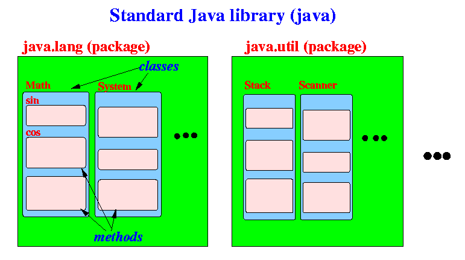
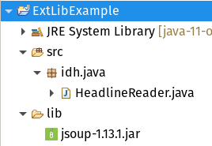

# Programmbibliotheken<!-- omit in toc -->


## Was ist eine Programmbibliothek?

Eine [Programmbibliothek](../Glossar.md#programmbibliothek) (eng. _software library_ oder auch nur _library_) ist eine Sammlung von Klassen (bzw. auch Interfaces etc.), die dazu gedacht sind, in anderen Programmen wiederverwendet zu werden. Auf diese Weise muss ein\*e Entwickler\*in komplexe Konzepte nicht jedes mal neu erfinden und umsetzen, sondern kann [auf vorhandene Lösungen zurückgreifen](https://en.wikipedia.org/wiki/Reinventing_the_wheel), die im besten Fall von Spezialist\*innen entwickelt und von tausenden Programmierer\*innen genutzt und getestet werden.


## Die Java Class Library

Erinnern wir uns zur Orientierung noch einmal daran, dass wir von Anfang an bereits eine Programmbibliothek benutzen: Die [Java Class Library](https://en.wikipedia.org/wiki/Java_Class_Library). Sie ist Bestandteil des [JDK](Die-Programmiersprache-Java.md#jdk) und steht damit in jedem Java-Programm zur Verfügung. Sie umfasst [zahlreiche Klassen](https://docs.oracle.com/en/java/javase/11/docs/api/allclasses.html) (...), die zum Schreiben von Java-Programmen entweder grundlegend (siehe Paket `java.lang` in der Grafik unten) oder mit hoher Wahrscheinlichkeit nützlich sind.

  
Quelle: [www.mathcs.emory.edu](https://www.mathcs.emory.edu/~cheung/Courses/170/Syllabus/04/java-lib.html)

Das Paket `java.lang` enthält Klassen (...), die so grundlegend für die Java-Programmierung sind, dass es automatisch zum [Classpath](https://de.wikipedia.org/wiki/Klassenpfad) eines Java-Programms gehört. Klassen (...) aus `java.lang` müssen deshalb auch nicht mit dem `import` statement importiert werden.

```java
/*
* Weder für "System", noch für "Math"
* ist ein Import notwendig!
*/

System.out.println(Math.random());
```

Alle weiteren Bestandteile der _JCL_ stehen nach Bedarf zur Verfügung, müssen also ggf. importiert werden.


## Externe Programmbibliotheken

Natürlich kommt es vor, dass die Java Class Library nicht alles anbietet, was man braucht. Und gerade für komplexere Probleme, die nicht einzigartig sind, sollte man - wie bereits erwähnt - lieber keine eigenen Lösungen entwickeln. Stattdessen empfiehlt es sich, auf das riesige Angebot frei verfügbarer (im Sinne von [Open Source](https://opensource.org/osd)) Programmbibliotheken zurück zu greifen.

Es gibt elegantere (und nachhaltigere) Methoden, eine externe Programmbibliothek zu verwenden, als sich diese manuell herunterzuladen und einzubinden (die Möglichkeiten hierfür werden im nächsten Abschnitt kurz erläutert). Aber auch das ist möglich und reicht manchmal völlig aus.

Das folgende Szenario soll die möglichen Vorteile der Verwendung externer Bibliotheken verdeutlichen und zeigen, wie sich diese (zunächst ohne Build Tools, siehe unten) mit Hilfe der IDE in das Programm einbinden lassen.

Nehmen wir an, wir wollen die Überschrift der aktuellsten [Pressemitteilung von der Internetseite der Universität zu Köln](https://portal.uni-koeln.de/universitaet/aktuell/presseinformationen) extrahieren und einfach nur auf der Konsole ausgeben. Versuchen wir es zunächst ohne externe Bibliotheken, also nur mit den Hausmitteln von Java (die [Fehlerbehandlung](Fehlerbehandlung.md) wurde zugunsten der Übersichtlichkeit entfernt):

> ⚠ **ACHTUNG!** Das folgende Beispiel zeigt ganz bewusst sehr _schlechten_, _unsinnigen_ Code! Man sollte [niemals HTML (oder irgendeine andere formale Sprache) mit String-Operationen parsen](https://stackoverflow.com/questions/1732348/regex-match-open-tags-except-xhtml-self-contained-tags), auch (oder: erst recht!) nicht mit Regulären ausdrücken! 

```java
String urlString = "https://portal.uni-koeln.de/"
		+ "universitaet/aktuell/presseinformationen";

BufferedReader br =
        new BufferedReader(
            new InputStreamReader(
                new URL(urlString).openStream())));

String line;
StringBuilder sb = new StringBuilder();

while ((line = br.readLine()) != null) {
    sb.append(line);
    sb.append(System.lineSeparator());
}

// VORSICHT, UNSINN!!! Niemals HTML mit String-Operationen parsen!!!
String heading = sb.toString()
        .replaceAll("\n", " ")
        .replaceFirst("^.*?<article([\\s\\S]*?)<\\/article>.*?$", "$1")
        .replaceFirst("^.*?<h2>([\\s\\S]*?)<\\/h2>.*?$", "$1")
        .trim();

System.out.println(heading);
```

Immerhin, die Ausgabe auf der Konsole lautet:

```
Sonnenscheinrekord im ersten COVID-19 Lockdown durch ungewöhnliches Wetter
```

**ABER** das ist eine Menge Code - und er ist auch noch alles andere als robust! Viele ungeschriebene Gesetze wurden verletzt. Es ist außerdem nicht auf den ersten Blick ersichtlich, was hier genau passieren soll. Eine schlechte, sperrige Lösung!

Entscheiden wir uns also doch lieber dazu, eine externe Bibliothek zu nutzen, die auf das Lesen und Parsen von HTML-Seiten spezialisiert ist! Eine (zu Recht!) sehr prominente Kandidatin ist [jsoup](https://jsoup.org/).

Wir laden uns also die neueste Version von _jsoup_ als `.jar` Datei (Java Archive) herunter und platzieren sie in einem eigens angelegten Ordner `lib` (_libraries_) in unseren Projekt (der Name das Ordners ist beliebig):



Jetzt ist die Bibliothek schon mal vorhanden - aber unser Programm weiß noch nichts davon. Fügen wir sie also zum _Build Path_ unseres Projektes hinzu (natürlich mit Hilfe unserer IDE). Dieser umfasst alle Ressourcen, die beim Kompilieren des Programms mit einbezogen werden sollen.

> 👉 Rechtsklick auf das Projekt &rarr; Properties &rarr; Java Build Path &rarr; Libraries &rarr; Classpath &rarr; Add JARs &rarr; `.jar` Datei aus dem Projekt-Ordner auswählen!

Ab jetzt sind die Klassen (...), die Teil der _jsoup_-Bibliothek sind, für unser Programm verfügbar. Wir müssen sie einfach nur mittels `import` importieren!

Sehen wir uns also die (sehr gute) [Dokumentation von jsoup](https://jsoup.org/cookbook/) an und machen uns ein Bild davon, wie uns die Bibiothek bei unserem Problem helfen kann (dieser Prozess wird hier nicht erläutert)! Der Code aus dem Beispiel oben lässt sich unter Verwendung der [API](../Glossar.md#api) von _jsoup_ nicht nur schöner und lesbarer, sondern auch in jeder anderen Hinsicht besser umsetzen (auch hier verzichten wird der Übersichtlichkeit halber auf die Fehlerbehandlung):

```java
String urlString = "https://portal.uni-koeln.de/"
		+ "universitaet/aktuell/presseinformationen";
Document doc = Jsoup.connect(urlString).get();
String heading = doc.selectFirst("article h2").text();
System.out.println(heading);
```

... und das war's auch schon! Wir sehen ganz deutlich: Die Java Class Library ist zwar extrem umfangreich, aber die Bordmittel reichen eben nicht immer aus.

**Fazit: Es lohnt sich, nach guten Programmbibliotheken Ausschau zu halten!**


## Build (Management) Tools

> 🚧 **TODO**


### Maven

> 🚧 **TODO**