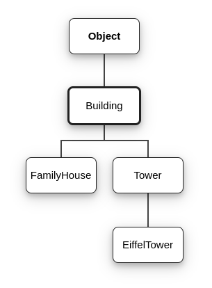

# Vererbung I: Grundlagen 👪<!-- omit in toc -->

Klassen können Eigenschaften (eng.: _properties_ bzw. Felder) und Fähigkeiten (Methoden) von anderen Klassen _erben_.

- [Grundlagen](#grundlagen)
  - [Was ist Vererbung?](#was-ist-vererbung)
  - [Wozu braucht man Vererbung?](#wozu-braucht-man-vererbung)
  - [Terminologie](#terminologie)
- [`extends`](#extends)
- [Die Klasse `Object`](#die-klasse-object)
- [Keine Mehrfachvererbung](#keine-mehrfachvererbung)
- [`super`](#super)
- [`instanceof`](#instanceof)
- [Überschreiben von Methoden](#überschreiben-von-methoden)
- [`@Override`](#override)


## Grundlagen

### Was ist Vererbung?
Bei Vererbung handelt es sich um eines der wichtigsten und grundlegendsten Konzepte der 🔭 [Objektorientierten Programmierung](OOP-Klassen-und-Objekte.md). Klassen können andere Klassen _erweitern_, wodurch sie die Eigenschaften und Fähigkeiten, die in der erweiterten Klasse definiert sind, von dieser _erben_ (eng.: _inherit_).

### Wozu braucht man Vererbung?
Eigenschaften und Fähigkeiten von Klassen werden bei einer Vererbung (Erweiterung durch andere Klassen) zu Eigenschaften und Fähigkeiten aller jeweils erbenden Klassen. So wird nicht nur Code wiederverwendet, sondern die Logik dieser Eigenschaften und Fähigkeiten lässt sich für _alle_ erbenden Klassen an einer einzigen Stelle ändern, ohne den Code jeder einzelnen erbenden Klasse ändern zu müssen.

Programm-Code, der Vererbung nutzt, modelliert reale Phänomene und Beziehungen auf semantisch klare Weise. Am besten lässt sich das an einem **Beispiel** verdeutlichen:

👉 Ein **_Wohnhaus_** mit Küche, Diele, Bad und 3 Zimmern erweitert das Konzept eines **_Gebäudes_** (von Menschen gebaut, nicht mobil). Somit "erbt" das **_Wohnhaus_** die Eigenschaften des Konzeptes **_Gebäude_**, da es ebenfalls von Menschen gebaut und nicht mobil ist.

Vererbung ermöglicht außerdem 🔗[_Polymorphie_](https://de.wikipedia.org/wiki/Polymorphie_(Programmierung)) unter Typen, denn jede Instanz einer Klasse ist auch eine Instanz aller Superklassen (siehe _Terminologie_!). Bezogen auf das Beispiel oben bedeutet das nichts anderes als _"Ein Wohnhaus ist ein Gebäude"_.

### Terminologie
Die _vererbenden_ Klassen werden als **Superklassen**, **Elternklassen** oder **Überklassen** (Englisch _parent class_ oder _super class_) bezeichnet, die _erbenden_ hingegen respektive als **Subklassen**, **Kindklassen** oder **Unterklassen** (Englisch _child class_ oder _sub class_).  
Die _erbende_ Klasse **erweitert** die Klasse, von der sie erbt, da sie (normalerweise) Eigenschaften und Fähigkeiten besitzt, die über jene der Superklasse hinausgehen.


## `extends`

Eine Klasse `B` erweitert eine Klasse `A`, indem ihre Signatur mit dem Schlüsselwort `extends` (eng.: _erweitert_) versehen wird:

```java
public class B extends A {
  // ...
}
```

Klasse `B` erbt somit von Klasse `A` (und deren Superklassen, also mindestens auch von `Object`!)

> 💬 Wenn man aus irgendeinem Grund der Meinung ist, dass eine Klasse **nicht** erweitert werden sollte, dann kann man dies übrigens verhindern, indem man sie mit dem Schlüsselwort `final` zu einer "finalen" Klasse macht : `public final class NoChildrenPlease { ... }`


## Die Klasse `Object`

**Alle** Klassen erben **automatisch** von der Klasse `Object`. Das ergibt Sinn: Denn die Instanzen aller Klassen sind immerhin Objekte. Eine Klasse `B`, die eine Klasse `A` erweitert (und also von dieser erbt) ist ebenfalls eine Instanz von `Object` - denn `A` erweitert implizit `Object`.



> 🔗 [Hier](https://docs.oracle.com/javase/8/docs/api/java/lang/Object.html) findest du die offizielle Dokumentation der Klasse `Object`

Die Klasse `Object` besitzt eigene Methoden, die selbstverständlich auch automatisch an alle Java-Klassen vererbt werden und somit Methoden **aller Objekte in Java** sind. Einige davon sollte man unbedingt von Anfang an kennen:

- `equals(Object obj)` ([Doku](https://docs.oracle.com/javase/8/docs/api/java/lang/Object.html#equals-java.lang.Object-)) vergleicht _dieses_ Objekt mit dem übergebenen Objekt `obj` und gibt `true` bzw. `false` zurück, wenn die beiden Objekte "gleich" sind. "Gleichheit" ist hier dringend von "Identität" zu unterscheiden! Siehe auch [hier](Objekte-II-Repraesentation-Identitaet-Gleichheit.md#equals).
- `hashCode()` ([Doku](https://docs.oracle.com/javase/8/docs/api/java/lang/Object.html#hashCode--)) gibt einen 🔭[Hash-Code](Objekte-II-Repraesentation-Identitaet-Gleichheit.md#hashcode) in Form eines `int`-Wertes zurück, der das Objekt repräsentiert.
- `toString()` ([Doku](https://docs.oracle.com/javase/8/docs/api/java/lang/Object.html#toString--)) gibt eine textuelle Repräsentation des Objektes als `String` zurück.

> 👩‍🏫 Alle diese Methoden der Klasse `Object` werden in anderen Klassen sehr häufig [überschrieben](#überschreiben-von-methoden), weil ihre optimale Implementation sehr davon abhängt, worum es sich bei der jeweiligen Klasse handelt. Mehr dazu findest du [hier](Objekte-II-Repraesentation-Identitaet-Gleichheit.md).


## Keine Mehrfachvererbung

Jede Klasse kann in Java nur von einer anderen Klasse erben. Es ist **keine Mehrfachvererbung** möglich!

```java
// jede Person ist auch ein Object
public class Person(){
  protected String name;
}

// jeder User ist auch eine Person und ein Object
// und hat einen Namen UND einen Username
public class User extends Person {
  private String userName;
}
```

> 💬 Der Zugriffsmodifizierer `protected` erlaubt nur den Zugriff durch erbende Klassen! Siehe auch [hier](Objekte-I-Initialisierung-Members-Zugriff.md#zugriffs-sichtbarkeitsmodifizierer).


## `super`

Mit dem Schlüsselwort `super` referenziert eine Klasse ihre Superklasse (siehe [Vererbung](#vererbung))!

Es ist üblich (und sinnvoll) in Konstruktoren **zuerst** den Konstruktor der jeweiligen Superklasse aufzurufen:

```java
public class User extends Person {

  public User(){
    super(); // Konstruktor von "Person"
    // Konstruktor-Code von "User"...
  }

  // ...
}
```


## `instanceof`

`instanceof` ist ein Operator, der die Zugehörigkeit eines Objektes zu einem bestimmten Typ überprüft:

```java
User user = new User("Tonky McWigglefritts");
System.out.println(user instanceof Person); // true
System.out.println(user instanceof Object); // true
System.out.println(user instanceof CharSequence); // false
System.out.println(user instanceof List); // false
```


## Überschreiben von Methoden

Die Methoden von Klassen können in Subklassen (also in erweiternden/erbenden Klassen) überschrieben werden. Ein Aufruf referenziert dann diese überschreibende Methode der erweiternden Klasse und nicht mehr die Methode der Superklasse.

```java
// jede Person ist auch ein Object
public class Person(){
  public String something(){
    // ...
  }
}

// jeder User ist auch eine Person und ein Object
// und hat einen Namen UND einen Username
public class User extends Person {
  @Override
  public String something(){
    // eigene, unabhängige Implementation!
  }
}
```


## `@Override`

Eine überscheibende Methode wird im Quelltext per Konvention markiert durch die `@Override`-Annotation. Diese ist im Prinzip nur eine "Anmerkung", die darauf hinweist, dass es sich um eine überschreibende Methode handelt. Sie ist aber durchaus wichtig, denn diese Anmerkung wird vom 👉[Compiler](../Glossar.md#compiler) überprüft:

**📚 Aus den docs zu** [`@Override`](https://docs.oracle.com/javase/8/docs/api/java/lang/Override.html):  
> _Indicates that a method declaration is intended to override a method declaration in a supertype. If a method is annotated with this annotation type compilers are required to generate an error message unless at least one of the following conditions hold:_
>
> -   _The method does override or implement a method declared in a supertype._
> -   _The method has a signature that is override-equivalent to that of any public method declared in Object._

👉 `@Override` ist also _nicht nötig_, macht aber den Code lesbarer und veranlasst den Compiler dazu, hilfreiche Fehlermeldungen zu liefern. Es ist deshalb Konvention, diese Annotation zu verwenden!